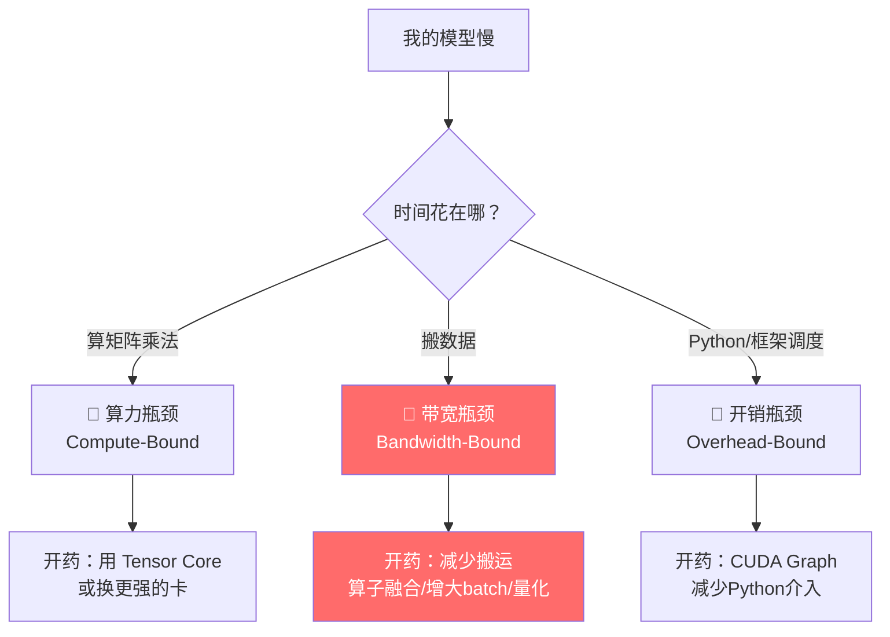
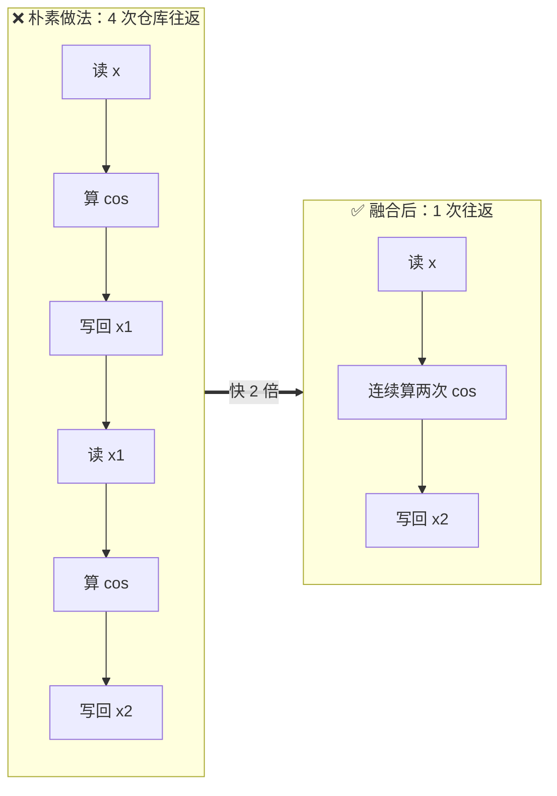
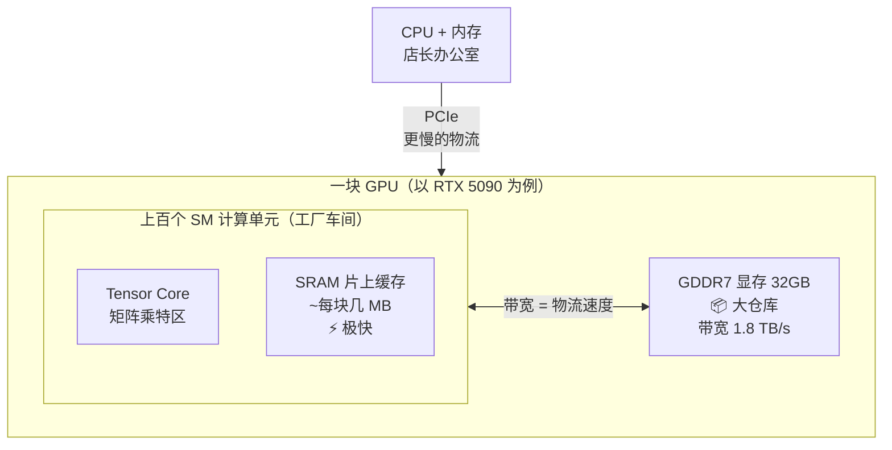
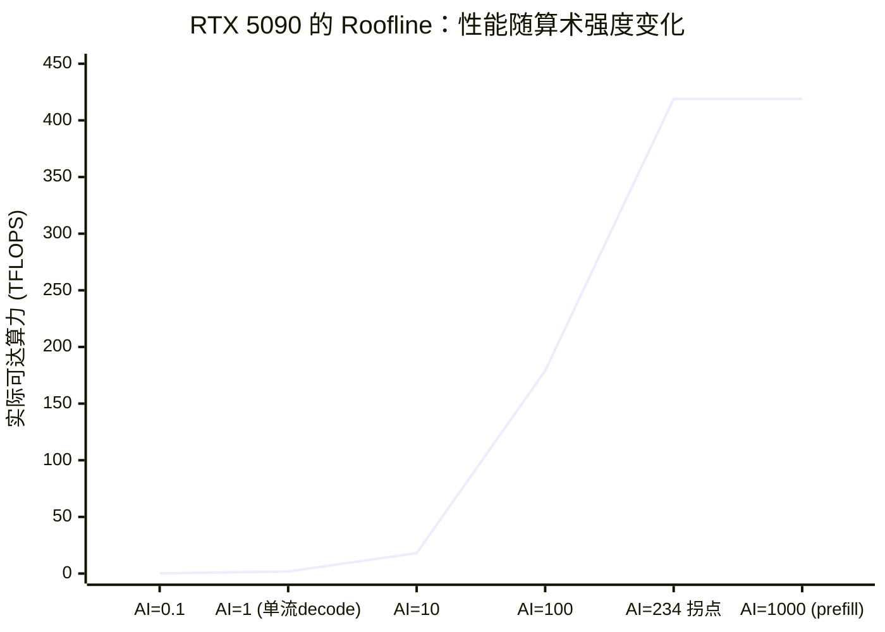
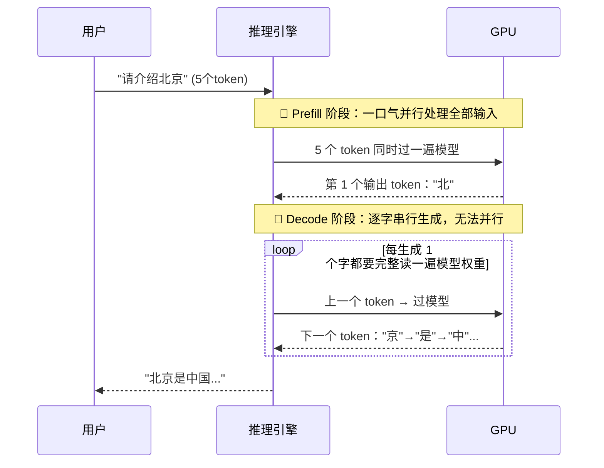
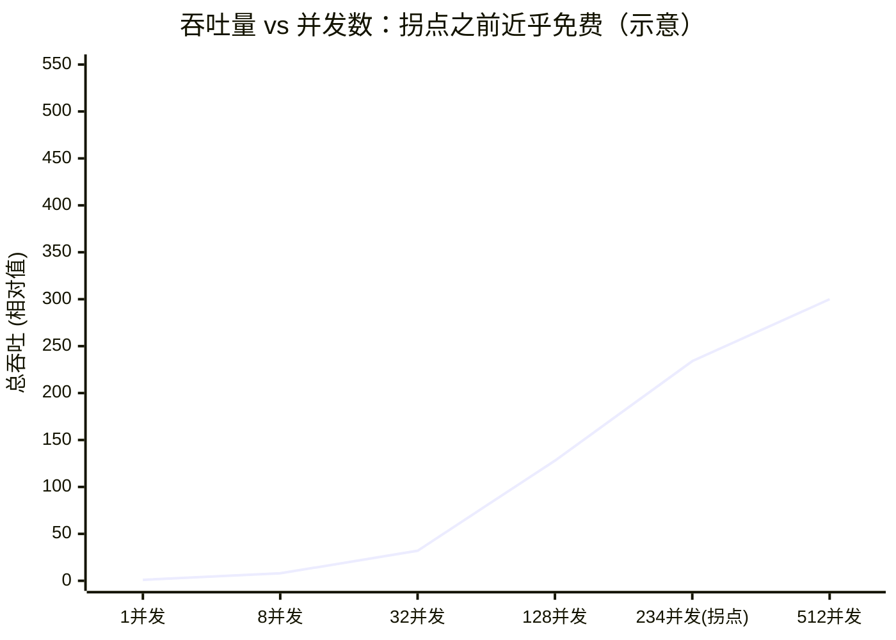
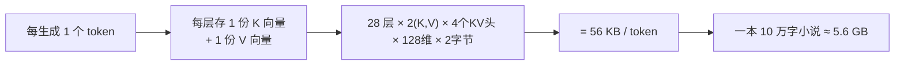
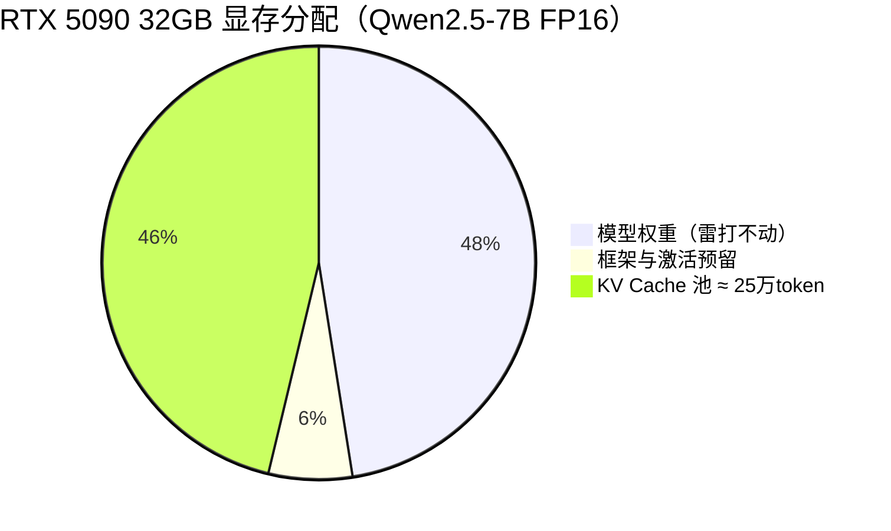
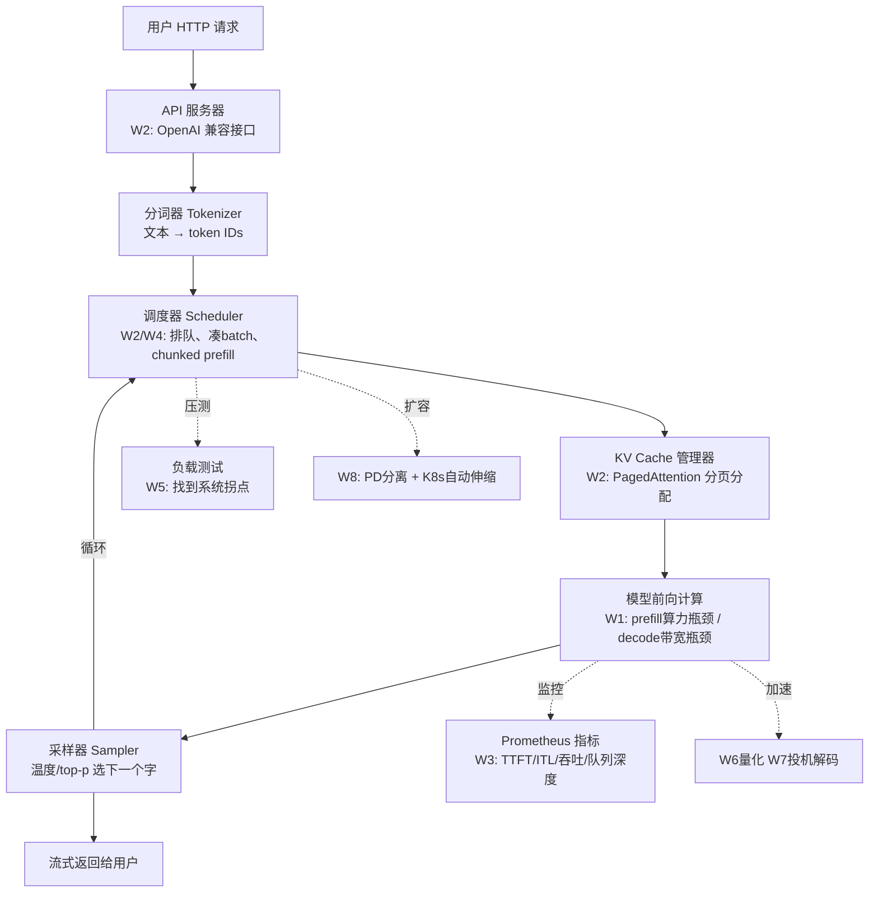

# Week 1 · 心智模型篇：看懂大模型推理的"物理定律"

> 🎯 **本周目标**：学会用"算术强度"和"Roofline（屋顶线）模型"这两把尺子，一眼判断任何推理场景的瓶颈在哪。
> 这是整个课程的地基。后面学的所有优化技术（量化、批处理、投机解码、PD 分离），本质都是在同一张图上挪位置。
> 📖 阅读时长约 40 分钟，零基础可读。

---

## 0. 先建立一个直觉：为什么"跑大模型"慢？

想象你开了一家**奶茶店**：

- **制作台**（算力/Compute）：摇奶茶的机器，速度极快，一秒能摇 100 杯
- **仓库取货**（内存带宽/Memory Bandwidth）：原料都放在后厨仓库，店员每次只能端一小盘回来
- **店长指挥**（开销/Overhead）：每做一杯都要问店长"下一步做什么"，店长反应很慢

现在问题来了：如果店员大部分时间都花在**跑去仓库取原料**上，你买一台快 10 倍的摇茶机有用吗？——没用。

**大模型推理的"慢"，绝大多数时候不是算得慢，而是"搬数据"慢。** 整个 Week 1 就是要把这个直觉变成能计算、能预测的工程方法。

---

## 1. 三个性能区间（Performance Regime）：先诊断，再开药

这是 Horace He（PyTorch 核心开发者）那篇著名文章的核心思想。任何深度学习程序的时间只花在三种地方：



> 🔴 **剧透**：大模型**逐字生成**阶段几乎永远是"带宽瓶颈"（标红那个）。这就是为什么这张图上红色的路是本课程的主线。

### 1.1 名词解释（别怕，都很简单）

| 英文术语 | 中文 | 大白话 |
|---|---|---|
| FLOPS | 每秒浮点运算次数 | "算力"，一秒能做多少万亿次乘加 |
| Memory Bandwidth | 内存带宽 | "搬运速度"，一秒能从显存搬多少 GB 数据 |
| Kernel | GPU 核函数 | GPU 上执行的一次具体计算任务（比如一次矩阵乘） |
| Tensor Core | 张量核心 | GPU 里专门做矩阵乘法的"特区"，比普通单元快 16 倍 |
| DRAM / 显存 | 大容量慢速存储 | nvidia-smi 里看到的那个 32GB，"仓库" |
| SRAM / 片上缓存 | 小容量快速存储 | 紧挨着计算单元，"制作台台面" |

### 1.2 一个反直觉的事实：算得多 ≠ 花时间长

问：`relu(x)`（就一刀切断负数）和 `gelu(x)`（一大串公式），哪个快？

**答：一样快。** 因为它们的时间都花在"把 x 从显存搬进来、把结果写回去"上，真正的计算时间占比可以忽略。就像外卖的耗时取决于骑手路上时间，而不是厨师撒盐还是撒糖。

这个思想引出了深度学习里最重要的优化技术——**算子融合（Operator Fusion）**：



**与其把中间结果放回仓库再取出来，不如在台面上一口气全做完。** FlashAttention（后面会讲）本质上就是给 attention 做了一次教科书级的算子融合。

---

## 2. GPU 速成：5 分钟看懂你花几千块租的硬件



**关键数字对比（培养"数字感"，顶级工程师的直觉来源）：**

| 硬件 | 显存带宽 | FP16 算力 | 拐点 ≈ 算力÷带宽 |
|---|---|---|---|
| A100 80GB（上代旗舰） | 2.0 TB/s | 312 TFLOPS | ~156 |
| H100（当代旗舰） | 3.35 TB/s | 989 TFLOPS | ~295 |
| **RTX 5090（我们的实验机）** | **1.79 TB/s** | **~419 TFLOPS** | **~234** |

> 💡 **看出趋势了吗？** 算力增长永远比带宽快（H100 的算力是 A100 的 3 倍，带宽只有 1.7 倍）。这意味着**"搬运"越来越成为瓶颈**——这就是为什么推理优化工程师越来越值钱。

---

## 3. Roofline 模型：一张图统治整个课程

### 3.1 核心概念：算术强度（Arithmetic Intensity）

```
算术强度 = 要做的计算量(FLOP) ÷ 要搬的数据量(Byte)
```

它回答一个问题：**"搬 1 字节数据进来，你能用它做几次计算？"**

- 搬 1 字节只做 1 次计算 → 搬运工累死，机器闲着 → **带宽瓶颈**
- 搬 1 字节做 1000 次计算 → 机器累死，搬运工闲着 → **算力瓶颈**

### 3.2 屋顶线图

硬件能达到的实际性能 = `min(算术强度 × 带宽, 峰值算力)`，画出来像一个屋顶：



- 拐点左边（斜线区）：性能被带宽卡住，**换更强的算力没用**
- 拐点右边（平台区）：性能被算力卡住，**换更快的显存没用**
- **拐点位置 = 峰值算力 ÷ 峰值带宽 = 419 ÷ 1.79 ≈ 234**

### 3.3 这个模型将贯穿全课程（重要！）

| 后续技术（周） | 在这张图上的动作 |
|---|---|
| 增大 batch（W4 连续批处理） | 把算术强度从 1 推向拐点 234，向右移动 ➡️ |
| 量化（W6） | 要搬的字节数 ÷2/÷4，等于把斜率抬陡，提前撞屋顶 ⬆️ |
| 投机解码（W7） | 利用左侧闲置的算力，一次"猜"多个 token 🎲 |
| PD 分离（W8） | prefill 在屋顶右边、decode 在左边，抢一张卡互相拖累 → 拆开 ✂️ |

---

## 4. Prefill vs Decode：一次对话的两副面孔

大模型回答问题时，过程分成两个阶段：



**为什么 decode 无法并行？** 因为第 N 个字依赖前 N-1 个字的结果（这叫**自回归 / Autoregressive**），就像写作必须一个字一个字往下写，不能同时写第 5 句和第 6 句。

### 4.1 两个阶段的瓶颈完全不同（本周最重要的结论）

| | Prefill（读输入） | Decode（写输出） |
|---|---|---|
| 权重读取次数 | 全部 token **共享 1 次**读取 | **每 1 个 token 读 1 次** |
| 算术强度 | ≈ prompt 长度（几百~几千） | ≈ batch 大小（单用户=1） |
| 在 Roofline 上的位置 | 右侧平台区 | 左侧斜线区 |
| 瓶颈 | 💪 算力 | 🚚 带宽 |
| 用户感知指标 | **TTFT**（首字延迟） | **ITL**（字间延迟/流畅度） |

### 4.2 算一笔账：单用户 decode 的物理上限

Qwen2.5-7B，FP16 精度，权重约 **15.2 GB**。每生成 1 个字都要把这 15.2 GB 从显存完整读一遍：

```
上限速度 = 带宽 ÷ 权重字节 = 1792 GB/s ÷ 15.2 GB ≈ 118 字/秒
```

**这就是物理定律，任何软件技巧都无法突破它。** 想更快？只有三条路（都是后面的课程）：
1. **量化**：把权重从 15.2GB 压到 3.8GB（INT4）→ 上限变 470 字/秒
2. **投机解码**：用小模型一次猜好几个字，大模型批量验收 → 摊薄读取次数
3. **换带宽更高的卡**：H100 的 HBM3 带宽 3.35 TB/s → 上限翻倍

### 4.3 神奇的"免费午餐"：增大 batch 不花钱

单用户时算术强度=1，离拐点 234 差着 200 多倍。这意味着：**1 个用户和 200 个用户同时生成，耗时几乎一样！**（权重只读一遍，200 份计算在右侧平台区之前都是"顺便"做的）



> 💰 **这就是大模型服务的商业模式本身**：单用户跑得再快也只能到 118 字/秒的零头利用率；把几百个用户凑在一起（**连续批处理 / Continuous Batching，Week 4 主题**），同一份权重读取服务几百人，成本直接除以几百。OpenAI 赚钱的秘密，一半在这张图里。

---

## 5. KV Cache：用显存换时间的经典交易

### 5.1 为什么需要它？

生成第 100 个字时，attention 机制需要"回顾"前面 99 个字算出来的 Key 和 Value 向量。两个选择：

- ❌ **重算**：每次都把前 99 个字重新算一遍 → 计算量随长度平方增长，越写越慢
- ✅ **缓存**：把算过的 K、V 向量存在显存里，随取随用 → 这就是 **KV Cache**

### 5.2 它占多少地方？（以 Qwen2.5-7B 为例）



```
KV Cache 大小 = 2 × 层数 × KV头数 × 每头维度 × 精度字节 × 总token数 × batch
```

> 📝 **GQA 是什么？为什么重要？** 老式模型（如 Llama-2-7B）每个注意力头都配独立 KV → 每 token 要 448 KB。Qwen2.5 用 **GQA（分组查询注意力）**：7 个查询头共享 1 组 KV → 直接省 8 倍显存。**省下的地方全都能换成更多并发用户**——这就是为什么 2023 年后所有新模型都用 GQA/MQA/MLA。

### 5.3 32GB 显存的分配账（Week 2 实验会亲眼看到）



KV Cache 池 ÷ 56KB ≈ **25 万个 token** 的空间 → 可以支撑 64 个用户 × 4K 上下文同时聊。**显存容量决定了能开多大 batch，batch 决定吞吐——所以"显存即吞吐"。**

### 5.4 KV Cache 引发的三大后续战役（课程预告）

| 问题 | 解法 | 周 |
|---|---|---|
| 长度不可预测，预留多了浪费 60-80% 显存 | **PagedAttention**：像操作系统管理内存一样分页管理 | W2 |
| 多人对话共享同样的 system prompt，重复计算 | **Prefix Caching / RadixAttention**：相同前缀只算一次 | W2/W4 |
| 上下文太长显存装不下 | **KV 驱逐 / StreamingLLM**：只留重要的 token | W7 |

---

## 6. 扩展加餐（超出原课程的部分）

> 以下内容是我为你补充的，把 Week 1 的模型推向"顶级工程师"需要的深度。

### 6.1 加餐一：FlashAttention 为什么快？（算子融合的巅峰之作）

标准 attention 要显式构造一个 `序列长度 × 序列长度` 的注意力分数矩阵——4K 上下文就是 1600 万元素，要写回显存再读回来做 softmax，再写回再读回来做乘法……

FlashAttention 的做法：**把矩阵切成小块（tiling），每一块在片上 SRAM 里完成"乘→softmax→再乘"全部步骤，中间结果永远不落显存。**

- FLOPs 一点没少（甚至多一点，因为要重算）
- 但显存读写从 O(N²) 降到 O(N) → 快 2-4 倍
- **完美诠释 Week 1 核心思想：减少搬运 > 减少计算**

### 6.2 加餐二：一次请求的完整旅程（鸟瞰全课程地图）



### 6.3 加餐三：顶级工程师的"数字感"速查表

| 数量级 | 数字 | 记法 |
|---|---|---|
| 7B 模型 FP16 权重 | ~15 GB | 参数量 × 2 字节 |
| 每 token 前向计算量 | 2 × 参数量 | 7B → 15 GFLOP |
| 单流 decode 上限 | 带宽 ÷ 权重大小 | 5090 上 ≈ 118 tok/s |
| 一块 KV Cache（vLLM 默认） | 16 个 token | 分页的"页大小" |
| H100 vs 5090 带宽 | 3.35 vs 1.79 TB/s | 数据中心卡贵在有 HBM |
| Python 解释器 vs GPU | 慢 ~10⁷ 倍 | 所以 V1 引擎拼命消灭 CPU 开销 |

### 6.4 加餐四：常被误解的三个问题

**Q1：nvidia-smi 显示 GPU 利用率 100%，说明性能很好？**
❌ 不是。它只表示"有 kernel 在跑"，一个带宽瓶颈的 kernel（比如单流 decode）也能把利用率刷到 100%，但算力可能只用了 0.5%。真正要看的是**实际 FLOPS ÷ 峰值 FLOPS**（MFU）。

**Q2：模型越小，单字生成越快吗？**
✅ 是的，而且几乎严格线性：decode 上限 = 带宽 ÷ 权重大小。7B → 118 tok/s，1.5B → 约 550 tok/s。

**Q3：增加 batch 会不会让每个人的字间延迟变高？**
在拐点（~234）之前几乎不会（免费午餐区）；过了拐点，延迟开始上升。**吞吐和延迟曲线的"膝盖"（knee）就是服务的最佳运营点**——Week 5 压测的全部目的就是找到它。

---

## 7. 自测题（合上笔记做，做完了再看答案）

1. 用奶茶店类比解释：为什么给带宽瓶颈的系统加算力没用？
2. 为什么 gelu 和 relu 耗时几乎一样？
3. Prefill 和 decode 各自的瓶颈是什么？对应的用户体验指标叫什么？
4. 已知某卡带宽 2 TB/s、算力 400 TFLOPS，拐点在哪？Qwen2.5-7B FP16 单流 decode 上限多少字/秒？
5. 为什么说"连续批处理是免费午餐"？午餐在哪结束？
6. GQA 省的是什么资源？为什么对服务方（而非训练方）价值巨大？
7. FlashAttention 没减少计算量，为什么更快？

<details><summary>📖 参考答案</summary>

1. 瓶颈在店员往返仓库的速度，摇茶机再快也只能等原料；对应 GPU 即算力单元空等显存数据。
2. 都是带宽瓶颈的逐元素算子，时间花在数据搬运上，计算量差异可忽略。
3. Prefill 算力瓶颈 → TTFT（首 token 延迟）；decode 带宽瓶颈 → ITL（字间延迟）。
4. 拐点 = 400÷2 = 200 FLOP/Byte；上限 = 2000GB/s ÷ 15.2GB ≈ 131 字/秒。
5. 拐点之前权重读取被所有请求共享，加用户几乎不增耗时；"拐点"之后延迟开始上涨，午餐结束。
6. 省 KV Cache 的显存和读取带宽；服务方的并发数 = 可用显存 ÷ 每 token KV 大小，GQA 直接把并发能力翻几倍。
7. 因为它把 O(N²) 的显存读写降到 O(N)，attention 是带宽瓶颈任务，搬运少了就快了。

</details>

---

## 8. 名词小词典（本周出现的英文，建议收藏）

| 英文 | 音译/缩写 | 中文含义 |
|---|---|---|
| Roofline Model | 屋顶线模型 | 性能 = min(强度×带宽, 峰值算力) 的可视化 |
| Arithmetic Intensity (AI) | 算术强度 | 每字节数据对应的计算次数 |
| Prefill | 预填充 | 并行处理输入 prompt 的阶段 |
| Decode | 解码 | 逐字生成输出的阶段 |
| TTFT (Time To First Token) | 首字延迟 | 发出请求到看到第一个字的时间 |
| ITL (Inter-Token Latency) | 字间延迟 | 相邻两个输出字之间的间隔 |
| KV Cache | KV 缓存 | 历史 token 的 Key/Value 向量缓存 |
| Operator Fusion | 算子融合 | 多个运算合并成一次显存往返 |
| GQA (Grouped-Query Attention) | 分组查询注意力 | 多个查询头共享一组 KV，省显存 |
| Batch / Batching | 批处理 | 多请求合并计算，摊薄权重读取 |
| Memory-Bound / Compute-Bound | 带宽/算力瓶颈 | 时间主要花在搬运 / 计算 |
| MFU | 算力利用率 | 实际算力 ÷ 峰值算力 |

## 9. 原始学习资料（想读原文时查）

- 📄 [Making Deep Learning Go Brrrr From First Principles](https://horace.io/brrr_intro.html) — Horace He（三 regime 圣经）
- 🎬 [Stanford CS336 Lecture 5: GPUs](https://www.youtube.com/watch?v=6OBtO9niT00) — GPU 硬件与 roofline（配[课件](https://github.com/stanford-cs336/spring2025-lectures)）
- 📄 [Transformer Inference Arithmetic](https://kipp.ly/transformer-inference-arithmetic/) — kipply（推理算术大全）
- 🎬 [CS336 Lecture 10: Inference](https://www.youtube.com/watch?v=fcgPYo3OtV0)（buffer）
- 📄 [Databricks: LLM Inference Performance Engineering](https://www.databricks.com/blog/llm-inference-performance-engineering-best-practices)（buffer）
