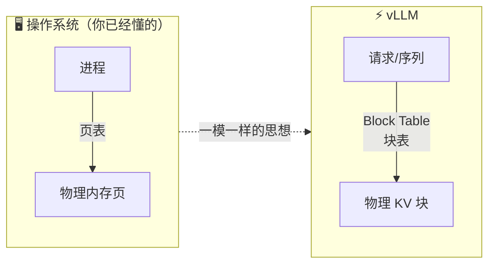
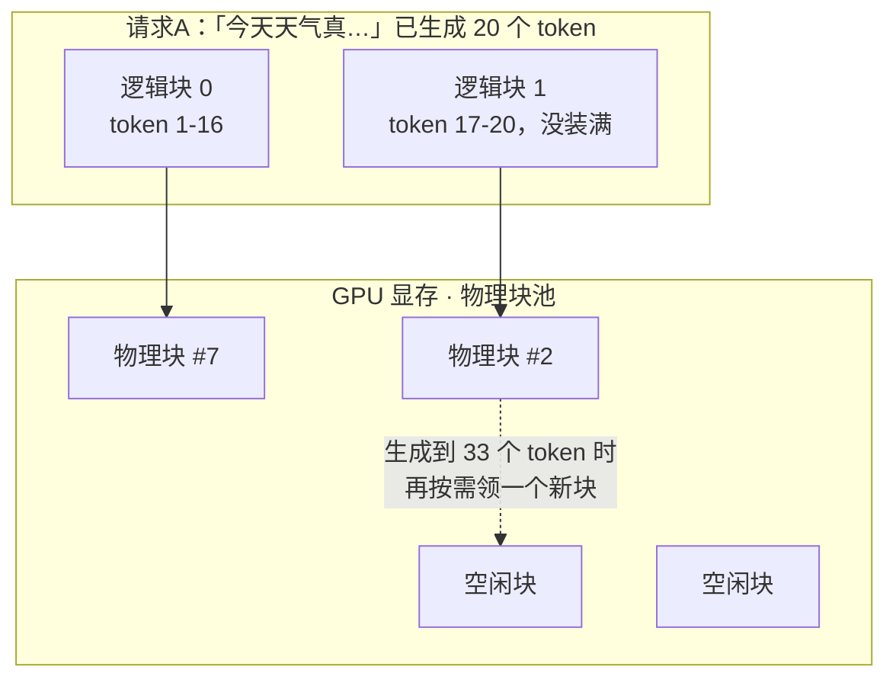
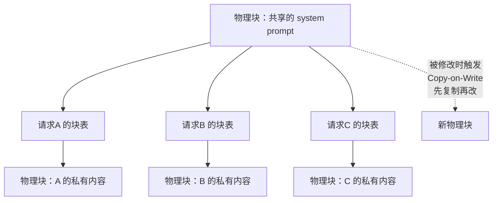
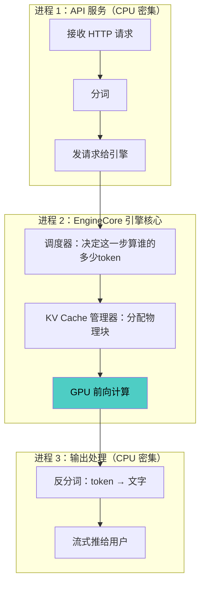
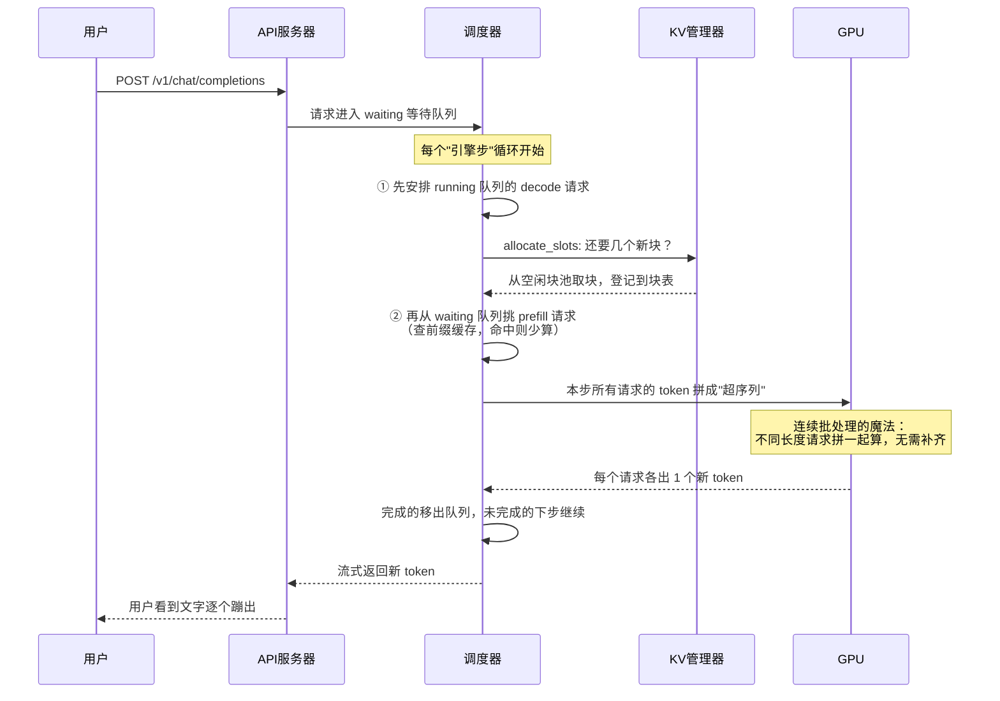

# Week 2 · vLLM 篇：部署你的第一个推理引擎，并读懂它的内脏

> 🎯 **本周目标**：① 亲手把 Qwen2.5-7B 跑成一个 OpenAI 兼容的 API 服务；② 搞懂 vLLM 的两大核心发明——PagedAttention 和 V1 调度器。
> 🔌 **GPU 日**：周二（部署，约 40 分钟）。周五读代码在自己电脑上即可。
> 📖 前置：Week 1 的"显存 = 吞吐"结论本周会变成你亲眼所见的数字。

---

## 0. vLLM 是什么？为什么是它？

vLLM 是 UC Berkeley 出生的开源推理引擎（推理引擎 = 专门把大模型"跑起来服务用户"的软件）。它 2023 年一鸣惊人的成绩：**吞吐比 HuggingFace 官方方案最高快 24 倍**，让 LMSYS 实验室用一半数量的 GPU 扛住了 Chatbot Arena 的百万级流量。

它的杀手锏叫 **PagedAttention**——而理解它只需要你中学时用过的直觉：**操作系统是怎么管理内存的**。

---

## 1. PagedAttention：把操作系统的内存分页搬进 GPU（周一）

### 1.1 问题：酒店预订的两难

把每个请求想象成**旅客住酒店**，KV Cache 就是房间：

- 旅客入住时**不知道自己住几天**（生成多少字事先不知道）
- 传统做法：怕你住得久，直接给你预留顶楼连通大套房 → 大部分人第二天就退房了，套房空着
- 结果：**60%~80% 的显存被浪费**在"以防万一"的预留上

Week 1 说过"显存即吞吐"——浪费显存 = 直接烧钱。

### 1.2 解法：化整为零，按需分配

PagedAttention 完全照抄操作系统的虚拟内存方案：



| 操作系统概念 | vLLM 对应物 |
|---|---|
| 字节 | 一个 token 的 KV 向量 |
| 页（Page） | **块（Block）**，默认装 16 个 token |
| 进程 | 一条生成序列（请求） |
| 页表 | **Block Table（块表）** |
| 物理内存 | GPU 显存里的 KV Cache 池 |

**工作流程**：不再预留连续大空间，而是把 KV Cache 切成固定大小的小块，**生成到第几个 token 就分配第几个块**；块在显存里可以东一块西一块，靠"块表"记录顺序。

### 1.3 一张图看懂块表



- 浪费只发生在**最后一个没装满的块**（最多 15 个 token 的空间）→ 总浪费 **< 4%**
- 对比传统方案的 60-80%，等于**同样的卡，并发能力翻 2-4 倍**

### 1.4 附带神技：多块序列共享同一个物理块

很多场景下不同请求有大段相同内容（比如大家都用同一段 system prompt，或一次采样 4 个回答）。PagedAttention 让多条序列的块表**指向同一个物理块**：



- 省内存最多 55%，吞吐最多 ×2.2
- **Copy-on-Write（写时复制）**：谁要在共享块上写入新内容，先复制一份再改自己的——和操作系统的 fork 一模一样

---

## 2. vLLM V1：一次"消灭 CPU"的重写（周三）

### 2.1 为什么重写？GPU 太快，CPU 成了短板

Week 1 讲过"开销瓶颈"（Python 慢、框架调度慢）。在 H100 上跑 8B 模型，GPU 每步计算只要 **~5 毫秒**——如果 CPU 做调度、分词、拼数据要花 6 毫秒，GPU 就得干等，**几千块一小时的卡在等 Python**。

V1 的全部主题就是：**让 CPU 的活和 GPU 的活并行，谁也不等谁。** 成果：kernel 几乎没换，纯靠架构优化，吞吐提升 **1.7 倍**。

### 2.2 V1 的五大设计（用人话讲）



| 设计 | 一句话人话解释 |
|---|---|
| **多进程流水线** | 分词/网络通信/输出处理放独立进程，和 GPU 计算同时进行，互不等待 |
| **统一调度表示** | 调度决策就是一个字典 `{请求ID: 本步算几个token}`——prefill、decode、切块、投机解码全都用这一句话表达 |
| **零开销前缀缓存** | 相同开头的请求自动复用 KV（命中率 0% 时性能损失 <1%，所以敢默认开启） |
| **持久化批处理** | 输入数据缓存复用，每步只更新"变化的部分"，不再每步从零拼装 |
| **CUDA Graph 回放** | 把一串 GPU 操作录成"录像带"，运行时直接播放，省掉每次的发射开销 |

> 💡 **记住这个数字的意义**：1.7× 提升**没改任何数学计算**，全部来自消灭 CPU 等待。这就是 Week 1"开销瓶颈"理论价值百万美元的实证。

---

## 3. 引擎解剖：一个请求在 vLLM 里的一生（周四）

来源：官方长文 [Inside vLLM](https://blog.vllm.ai/2025/09/05/anatomy-of-vllm.html)。这是本周最重要的图，值得看三遍：



### 3.1 三个必须记住的细节

**① 显存不够时的"抢占"（Preemption）**
当 KV 块池被占满、新请求进不来时，vLLM 会把低优先级请求的 KV 块**驱逐**，把它的进度回滚到待重算状态。Week 5 压测时如果看到 `num_requests_waiting` 飙升、延迟暴涨，八成就是系统在疯狂抢占——那种状态下的测试数据不可发布。

**② 块大小公式（每层每块）**
```
2(K和V) × 16(每块token数) × KV头数 × 每头维度 × 精度字节
```
Qwen2.5-7B：2×16×4×128×2B = 32KB/块/层，×28层 = 896KB/块。启动时 vLLM 会跑一次"假推理"量出剩余显存，算出总共能造多少个块——**这个数字周二实验时一定要从启动日志里找出来**，和 Week 1 的手算对照。

**③ Chunked Prefill（切块预填充）**
一条 8K 的超长 prompt 如果一口气跑完 prefill，会独占整个引擎步，其他几百个用户的 decode 全部卡住 → 大家集体"卡字"。解法：把长 prompt 切成小片（比如每次 512 token），**预填充切片和别人的 decode 混在同一步里跑**，谁也不堵谁。这是 V1 和 SGLang 的默认行为。

---

## 4. Build 日：亲手部署（周二 · 🔌 GPU）

### 4.1 开机三连（在本地 Mac 终端）

```bash
compshare instance list                       # 找到 5090 实例 ID
compshare instance start <id>                 # 开机
compshare instance wait <id> --state Running  # 等待就绪
compshare instance ssh <id> --show-sensitive  # 拿 SSH 登录命令
```

### 4.2 部署（SSH 进实例后执行）

```bash
pip install vllm

# ⚠️ 这条命令要保存好——后面十周反复在它上面加参数
vllm serve Qwen/Qwen2.5-7B-Instruct \
  --max-model-len 8192 \
  --gpu-memory-utilization 0.90 \
  --port 8000
```

**启动日志里重点找三行**：
1. `GPU KV cache size: XXX,XXX tokens` → 对照 Week 1 手算（~25万 token）
2. `Maximum concurrency for 8192 tokens per request: XX` → 系统自认的并发上限
3. CUDA Graph 捕获耗时 → V1 架构优化的直接体现

### 4.3 验证 + 第一次亲手感受 prefill/decode 差异

```bash
# 测速脚本：观察 TTFT（首字慢=prefill）和后续流式速度（decode）
curl http://localhost:8000/v1/chat/completions \
  -H "Content-Type: application/json" \
  -d '{
    "model": "Qwen/Qwen2.5-7B-Instruct",
    "messages": [{"role":"user","content":"用三句话解释什么是KV cache"}],
    "max_tokens": 200, "stream": true
  }' --no-buffer
```

**亲手验证 Week 1 预言**：
- 单请求 decode 速度应该明显低于 118 tok/s 理论上限（实际 60-90 tok/s 都正常）
- 把同一个请求复制成 10 个并发发出 → 每个请求的速度几乎不变（免费午餐区！）

### 4.4 🔴 关机铁律（省钱的根本）

```bash
compshare instance stop <id>
compshare instance list   # 确认状态是 Stopped 再走人
```

---

## 4.5 ✅ 实机实验记录（2026-09-07 已完成 · RTX 5090 实机）

**环境**：compshare 新实例 `cpod-1uzuvryhbo2m`（cn-sh2-01，5090×1 / 14C / 48GiB，¥3.21/h，全程 25 分钟 ≈ ¥1.3，实验完已关机）
**栈**：vLLM 0.25.1 + torch 2.11 + CUDA 13.0（5090 是 Blackwell 架构 sm_120，必须新版栈）
**模型**：`/model/ModelScope/Qwen/Qwen2.5-7B-Instruct`（平台共享模型库，开机自动挂载，免下载）

### 踩坑记录
1. 镜像名为 vLLM 但 vllm 在 **conda 环境**里：`/usr/local/miniconda3/envs/py312/bin/vllm`，不在默认 PATH
2. 首次启动崩溃：`FileNotFoundError: 'ninja'`——V1 的 FlashInfer JIT 编译需要 ninja，`pip install ninja` 后重启解决

### 启动日志：Week 1 手算 vs 实机

| 指标 | Week 1 手算 | 实机日志 | 误差 |
|---|---|---|---|
| 权重显存 | ~15.2 GB | **14.29 GiB** | ✅ 几乎一致 |
| KV Cache 容量 | ~25 万 token | **253,056 token** | ✅ 误差 <2% |
| 满上下文并发 | batch 64×4K | 8K 上下文 × **30.9 并发** | ✅ 同量级 |

> 手算公式第一次和真实系统对上——这就是 Week 1 模型的价值。

### 性能实验（max_tokens=256，temperature=0）

| 实验 | TTFT | 单请求 decode 速度 | 系统总吞吐 |
|---|---|---|---|
| 单用户 | 97ms | **104 tok/s** | 100 tok/s |
| 10 并发 | 39ms | 94.7 tok/s（仅降 9%） | **918 tok/s**（×9.1）|
| 64 并发 | 128ms | 90.9 tok/s（仅降 13%）| **5317 tok/s**（×53！）|

**三条 Week 1 预言全部命中**：
1. **单流 decode 上限**：实测 104 tok/s vs 理论上限 118 tok/s → 达到物理上限的 88%，带宽瓶颈实锤
2. **免费午餐**：并发从 1→64，每用户速度只降 13%，总吞吐翻了 53 倍——拐点（~234）之前加用户几乎免费
3. **batch 即吞吐**：同样的卡，服务 64 人比服务 1 人成本低 50 倍以上

---

## 5. 周五：读代码任务（不用 GPU）

克隆 [vllm 仓库](https://github.com/vllm-project/vllm)，跟读这条路径：

```
vllm/v1/core/kv_cache_manager.py   ← KV 块分配的核心
vllm/v1/core/sched/scheduler.py    ← 每步调度决策
```

**结业考题**：用三句话写清"一个请求的 KV 块是怎么被找到的"：

> 📝 **参考框架**：① 每个请求持有"逻辑块列表"，块表把第 i 个逻辑块映射到一个物理块号；② 前向计算准备阶段构建 `slot_mapping`，把每个 token 翻译成物理地址 = 块号 × 16 + 块内偏移；③ attention kernel 拿着这张映射表，从散落在显存各处的物理块里把 K/V 向量取出来算注意力。
>
> 写不出来就回去重读——这个能力比背概念值钱得多。

---

## 6. 扩展加餐：推理引擎江湖地图

vLLM 不是唯一选择，顶级工程师要知道牌桌上都有谁：

| 引擎 | 出身 | 看家本领 | 何时选它 |
|---|---|---|---|
| **vLLM** | UC Berkeley | 生态最大、功能最全 | 默认选择，本课程主力 |
| **SGLang** | LMSYS/伯克利 | RadixAttention 前缀复用最强 | 大量共享前缀的业务（W4 对比） |
| **TensorRT-LLM** | NVIDIA | 极限性能、编译期优化 | 追求极致且愿意被 N 卡绑死 |
| **TGI** | HuggingFace | 老牌、稳 | 老项目维护 |
| **llama.cpp** | 社区 | CPU/消费级硬件 | 个人电脑本地跑，非服务场景 |

---

## 7. 自测题

1. PagedAttention 把浪费从 60-80% 降到 <4%，它付出的"代价"是什么？（提示：操作系统分页的代价）
2. 为什么并行采样 4 个回答，在 PagedAttention 下几乎不占 4 倍显存？
3. V1 的 `{请求ID: token数}` 调度表示为什么能同时表达 prefill、decode、切块、投机解码？
4. 压测时看到等待队列暴涨 + 延迟飙升，系统大概率在干嘛？这种数据能发吗？
5. V1 提升 1.7× 没改 kernel，钱是从哪赚来的？

<details><summary>📖 参考答案</summary>

1. 需要维护块表做"逻辑→物理"翻译，且 attention kernel 要支持非连续内存读取，实现复杂度大幅上升。
2. 相同 prompt 的物理块被 4 条序列共享（引用计数），只有分叉后的内容各占各的块。
3. prefill = 给该请求 N 个 prompt token；decode = 给 1 个；切块 = 给预算内的一段；投机解码 = 给草稿的 k 个。统一成"这一步处理这个请求的几个 token"。
4. 在抢占（preemption）：KV 池耗尽，系统驱逐请求回收块、重算进度。这种"崩溃点"数据不可发布，要报告的是拐点。
5. 消灭 CPU 开销：多进程重叠、持久化批处理、CUDA Graph——GPU 等待时间被填满了。

</details>

## 8. 名词小词典（本周新增）

| 英文 | 中文 |
|---|---|
| PagedAttention | 分页注意力（KV Cache 分页管理算法） |
| Block Table | 块表（逻辑块→物理块映射） |
| Copy-on-Write (CoW) | 写时复制（共享块被修改时先复制） |
| Preemption | 抢占（显存不足时驱逐请求） |
| Chunked Prefill | 切块预填充（长 prompt 分片混入 decode 步） |
| Prefix Caching | 前缀缓存（相同开头请求复用 KV） |
| CUDA Graph | CUDA 图（预录 GPU 操作序列回放，省发射开销） |
| Continuous Batching | 连续批处理（请求随到随插，不等整批完成） |

## 9. 原始学习资料

- 📄 [vLLM & PagedAttention 公告](https://blog.vllm.ai/2023/06/20/vllm.html) · 📄 [SOSP 2023 论文](https://arxiv.org/abs/2309.06180)
- 📄 [vLLM V1 架构发布文](https://blog.vllm.ai/2025/01/27/v1-alpha-release.html) · 🎬 [Office Hours #22: V1 讲解](https://www.youtube.com/watch?v=jmzIvQZCLZM)
- 📄 [Inside vLLM：引擎解剖长文](https://blog.vllm.ai/2025/09/05/anatomy-of-vllm.html)（本周主教材）
- 📄 [Modal 的 vLLM 部署示例](https://modal.com/docs/examples/vllm_inference)
