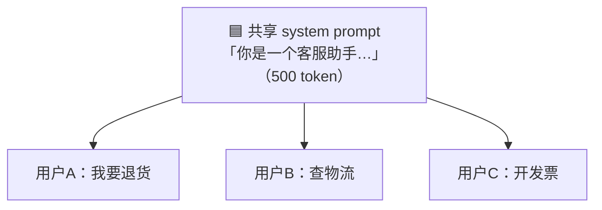
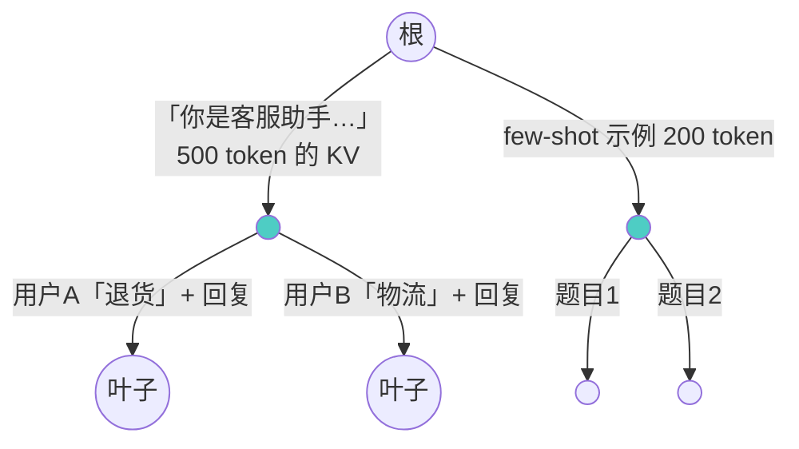
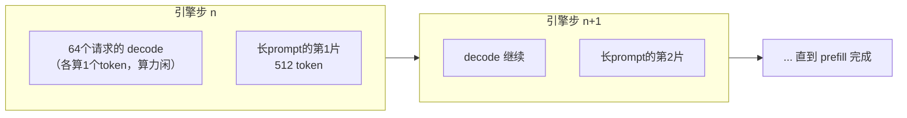

# Week 4 · SGLang 篇：第二引擎对决，读懂连续批处理

> 🎯 **本周核心教学法**：同模型、同硬件、同 prompt，只换引擎——让"引擎"成为唯一变量。
> 你将理解三件事：① RadixAttention 的前缀复用树 ② 连续批处理（所有现代引擎的共同底座）③ chunked prefill 为什么成为行业标准。
> 🔌 **GPU 日**：周二（部署 SGLang）+ Buffer 日（vLLM vs SGLang 正面对决）。

---

## 0. 一张地图：本周在全景中的位置

Week 2 我们学透了 vLLM 的 **PagedAttention**（分页管理显存）。本周引入对比组：

| | vLLM | SGLang |
|---|---|---|
| 显存管理 | PagedAttention（16 token/块的页表） | 同样分页，但**每 token 一页**（更细） |
| 前缀复用 | hash 前缀缓存（V1 默认开） | **RadixAttention 基数树**（本课主角） |
| 调度 | chunked prefill + 连续批处理 | 相同 + **缓存感知调度** |
| 出身 | UC Berkeley (2023) | LMSYS/UC Berkeley (2024) |

学完本周你会发现：**两个引擎 90% 的技术是共享的**，真正的差异点只有一个——前缀复用的数据结构和策略。这正是"对比学习"的价值。

---

## 1. 周一 · RadixAttention：给 KV Cache 建一棵"家谱树"

### 1.1 问题：这些重复计算每天都在烧钱

真实业务里，大量请求共享相同的开头：



- **客服系统**：一万个用户共享同一段 500 token 的 system prompt
- **多轮对话**：第 5 轮的 prompt = 前 4 轮全部内容 + 新消息（共享 99%）
- **few-shot 评测**：所有题目共享同一组示例
- **Self-consistency / Tree-of-Thought**：一个问题采样 10 条推理路径

如果没有复用，这 500 token 的前缀要被**重复 prefill 一万次**。Week 1 说过 prefill 是算力瓶颈——这就是纯纯的浪费。

### 1.2 RadixAttention 的数据结构：基数树（Radix Tree）

SGLang 把每条已处理过的序列的 KV Cache 挂在一棵树上，**树的边 = 一段 token 序列**，共享前缀天然成为公共路径：



新请求进来时：沿着树做**最长前缀匹配** → 命中部分的 KV 直接复用（跳过 prefill）→ 只算没见过的尾巴 → 把新序列插回树上。

**三个关键设计决策**：
1. **LRU 驱逐**：显存满了就踢掉最久没用的**叶子节点**（祖先被多个后代共享，踢叶子损失最小）
2. **缓存感知调度**：调度器优先处理"能命中缓存"的请求，提高命中率（vLLM 没有这层）
3. **开销为零**：树结构存在 CPU 上，维护开销极小。官方消融实验：**缓存命中率 0% 时也测不出性能损失**——所以敢永远开着

### 1.3 和 vLLM 前缀缓存的区别（考试重点）

| | vLLM Prefix Caching | SGLang RadixAttention |
|---|---|---|
| 匹配粒度 | **整块**（16 token）hash | **任意长度**前缀（树按 token 分裂） |
| 复用模式 | 只认"从头开始的整段前缀" | 任意分支共享，自动分裂节点 |
| 调度配合 | 无 | 缓存感知调度，优先命中 |
| 最佳场景 | 长共享前缀 | 多轮对话/树搜索等**复杂分支**场景 |

成绩：前缀密集负载下吞吐**最高 5 倍**于早期 vLLM；无命中时零开销。

---

## 2. 周四 · 连续批处理：所有引擎的共同底座

> 概念来自 Orca（OSDI 2022 论文），Anyscale 的科普文是最好的入门读物。

### 2.1 朴素批处理的浪费：等最慢的那个人

```mermaid
gantt
    title 朴素批处理：3 个请求绑成一批，谁也别想先走
    dateFormat X
    axisFormat %L
    section GPU 时间线
    请求A（10 token）:a1, 0, 10
    请求B（50 token）:b1, 0, 50
    请求C（20 token）:c1, 0, 20
    GPU 空转（A 已完成）:crit, 10, 50
    GPU 空转（C 已完成）:crit, 20, 50
```



一批请求同时进、同时出：生成 10 个 token 的请求要等生成 50 个的同伴，**GPU 一半时间在空转**。真实负载的输出长度是重尾分布（大部分短、少数超长），浪费更严重。

### 2.2 连续批处理：每一"步"都重新组队

```mermaid
gantt
    title 连续批处理：每个 iteration 都能加人/走人
    dateFormat X
    axisFormat %L
    section GPU 时间线
    请求A 完成立即释放 :a1, 0, 10
    请求D 立即补位 :d1, 10, 30
    请求E 补位 :e1, 20, 45
    请求B 一直在跑 :b1, 0, 50
```



**Iteration-level scheduling（迭代级调度）**：每生成一轮（iteration）就检查一次——谁完成了？释放显存。谁在排队？立刻补位。GPU 永远满负荷。

- 吞吐提升：相对朴素批处理 **8 倍**，叠加内存优化**最高 23 倍**（Anyscale 实测）
- 这就是 Week 2 实验里"64 并发时总吞吐 ×53"背后的机制
- Week 2 笔记里的"超序列拼接"（不同长度请求拼一起无 padding）就是它在内核层的实现

### 2.3 为什么 Week 1 说"batch 即吞吐"在这里落地

回看 Week 1 的 roofline：拐点（5090 上 ≈234）之前加 batch 免费。连续批处理就是**让 batch 永远贴着硬件允许的最大值跑**的工程机制——理论（roofline）和系统（调度器）在这里会师。

---

## 3. 周五 · Sarathi-Serve：chunked prefill 为什么成为行业标准

### 3.1 遗留问题：长 prompt 卡住所有人

连续批处理解决了"decode 互相等"，但还有一个堵点：

> 一个 8K token 的长 prompt 做 prefill 需要独占整个引擎步（算力密集），期间所有 decode 请求全部卡死——用户看到输出突然"停顿"一秒。

### 3.2 解法：把 prefill 切片，塞进 decode 的空隙里



洞察来自 Week 1：decode 是带宽瓶颈，**算力大量闲置**；prefill 是算力瓶颈，需要大量计算。把长 prompt 切成小片（如 512 token/片），**每片塞进 decode 的算力空档里**——就像往装满石头的罐子里倒沙子：

- decode 的 ITL 几乎不受影响（带宽没多花）
- prefill 不再独占引擎步（TTFT 变得平滑）
- 这招叫 **stall-free scheduling**（无停顿调度），论文是 Sarathi-Serve（OSDI 2024）
- **今天 vLLM V1 和 SGLang 都默认开启 chunked prefill**——你 Week 2 启动日志里的 `enable_chunked_prefill=True` 就是它

---

## 4. 设计空间总结（本周的"屠龙技"）

把三周学的东西放进一张决策表——以后看任何新引擎（TensorRT-LLM、Dynamo、llm-d）都用这四问拆解：

| 问题 | 选项 | 代表 |
|---|---|---|
| KV 怎么存？ | 分页（PagedAttention） | 全部主流引擎 |
| 批次怎么组？ | 连续批处理（iteration 级调度） | 全部主流引擎 |
| prefill 怎么处理？ | chunked prefill（切片混跑） | vLLM/SGLang 默认 |
| 前缀怎么复用？ | hash 块缓存 vs 基数树 | vLLM vs SGLang |

**一个引擎 = 这四个问题的答案 + 工程实现质量。**

---

## 5. 实验计划（下次开机做 🔌）

### 实验 A：部署 SGLang（周二任务）

```bash
# 在运行中的实例上（py312 环境）
pip install sglang

# 同模型、不同端口，和 vLLM 并存
python -m sglang.launch_server \
  --model-path /model/ModelScope/Qwen/Qwen2.5-7B-Instruct \
  --port 8001 --mem-fraction-static 0.40
```

> ⚠️ 注意显存分配：vLLM 已占 90%，SGLang 要用 `--mem-fraction-static 0.40` 错峰，或先停 vLLM。

### 实验 B：正面对决——共享前缀负载（Buffer 日）

```python
# 2000 token 的共享 system prompt + 每人不同的短问题 × 50 并发
# 分别打向 vLLM(:8000) 和 SGLang(:8001)
# 用 Week 3 的 Grafana 对比两者的 TTFT 曲线
```

**预期**：第一轮两者相当（都是冷缓存）；第二轮起 SGLang 的 TTFT 应明显更低（RadixAttention 命中），vLLM 靠 hash 缓存也会提速——**亲眼看到两种复用策略的差异**。

---

## 5.5 ✅ 实机对决结果（2026-09-08 · RTX 5090 实测）

**测试**：3360 token 共享客服 system prompt + 不同短问题，50 并发 × 2 轮（冷/热缓存），max_tokens=32。

| 引擎 | 冷缓存 TTFT p50 | 热缓存 TTFT p50 | 前缀复用提速 | 热轮总吞吐 |
|---|---|---|---|---|
| vLLM 0.28（hash 块缓存） | **747ms** | 231ms | 3.2× | 1909 tok/s |
| SGLang 0.5.19（RadixAttention） | 2136ms | **252ms** | 8.5× | 1995 tok/s |

**三个真实发现（比论文数字更有价值）**：

1. **两个引擎的前缀缓存都有效**，热轮 TTFT 几乎打平（231 vs 252ms）。SGLang 宣传的 5× 是对比 2023 年没有缓存的 vLLM 0.2.5——**基准测试的营销数字会过时，vLLM V1 已标配前缀缓存**。亲手测一遍才知道真相。
2. **冷启动差异惊人**：vLLM 首轮 TTFT 比 SGLang 快 2.9×（747 vs 2136ms），vLLM 的 chunked prefill + torch.compile 在 prefill 密集场景更强。
3. **工程结论**：生产选型不是"谁快用谁"，而是"谁在你的负载特征上快"——这就是为什么 Week 5 的压测方法论如此重要。

**踩坑实录（本节最值钱的经验）**：
- sglang[all] 会强制升级 torch 2.11→2.13，直接砸掉 vLLM 0.25.1（其 vllm_flash_attn 二进制扩展只认 2.11）
- 解法：升级 vLLM 到 0.28.0（正好要求 torch==2.13.0，与 sglang 0.5.19 完美共存）
- flashinfer-cubin 版本不匹配用 `FLASHINFER_DISABLE_VERSION_CHECK=1` 绕过
- `pip check` 是双引擎共存时的体检工具
- pkill/pgrep 的模式字符串会匹配到自己的启动命令导致"自杀"——kill 脚本里不要出现被 kill 进程的特征串

---

## 6. 自测题

1. 多轮对话场景下，RadixAttention 和 vLLM hash 缓存谁更有优势？为什么？
2. 为什么 LRU 驱逐只踢叶子节点？
3. 朴素批处理浪费 GPU 的根源是什么分布特征？
4. chunked prefill 为什么几乎不影响 decode 的 ITL？（用 Week 1 的瓶颈理论回答）
5. "一个引擎 = 四个问题的答案"，是哪四个？

<details><summary>📖 参考答案</summary>

1. RadixAttention。多轮对话是"同一前缀不断追加"的分支结构，树天然匹配；hash 块缓存只能认从头开始的整段前缀，中间分叉后复用率下降。
2. 祖先节点被多个后代共享，踢掉它等于同时作废多条序列的缓存；叶子只属于一条序列，损失最小。
3. 输出长度的重尾分布：大部分请求短、少数超长，"等最慢的人"导致大量空转。
4. decode 是带宽瓶颈，算力闲着；prefill 切片填的是算力空档，不增加带宽负担，所以 ITL 几乎不变。
5. KV 存储方式、批次组建方式、prefill 处理方式、前缀复用策略。

</details>

## 7. 名词小词典（本周新增）

| 英文 | 中文 |
|---|---|
| Radix Tree / Trie | 基数树/前缀树，共享前缀天然成为公共路径的数据结构 |
| LRU (Least Recently Used) | 最久未使用驱逐策略 |
| Continuous Batching | 连续批处理：每个 iteration 重组批次 |
| Iteration-level Scheduling | 迭代级调度（Orca 论文的核心概念） |
| Chunked Prefill | 切块预填充：长 prompt 切片混入 decode 步 |
| Stall-free Scheduling | 无停顿调度（Sarathi-Serve 论文） |
| Prefix Reuse / Prefix Cache Hit | 前缀复用 / 前缀缓存命中 |
| Heavy-tailed Distribution | 重尾分布：多数很短、少数超长 |

## 8. 原始学习资料

- 📄 [RadixAttention & SGLang 官方博客](https://lmsys.org/blog/2024-01-17-sglang/) · [NeurIPS 2024 论文](https://arxiv.org/abs/2312.07104)
- 🎬 [Efficient LLM Inference with SGLang](https://www.youtube.com/watch?v=Ny4xxErgFgQ)（作者 Lianmin Zheng 亲自讲）
- 📄 [Anyscale: Continuous Batching 科普](https://www.anyscale.com/blog/continuous-batching-llm-inference) · [Orca 论文 (OSDI 2022)](https://www.usenix.org/conference/osdi22/presentation/yu)
- 📄 [Sarathi-Serve (chunked prefill)](https://arxiv.org/abs/2403.02310)
- 📄 [SGLang v0.4 零开销调度器](https://lmsys.org/blog/2024-12-04-sglang-v0-4/)（buffer）
