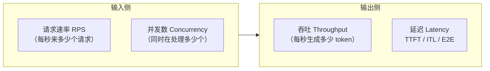
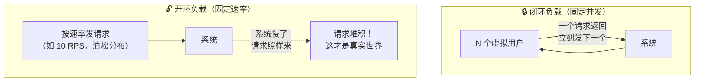
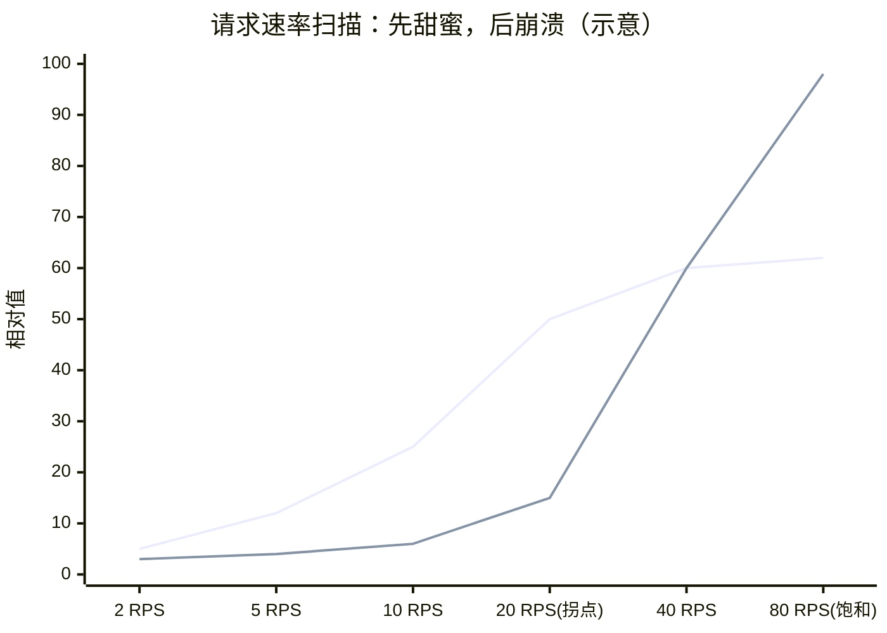

# Week 5 · 压测篇：做出"能辩护"的基准测试

> 🎯 **本周目标**：建立一套可复现的压测框架，扫过 1000 并发，找到系统的拐点。
> 这是全课程的"期中考试"——Week 2 的服务、Week 3 的监控、Week 4 的双引擎，全部在这周接受检验。
> 🔌 **GPU 日**：周二~周四（5090），**周五租 H100 冲千并发**。

---

## 0. 为什么压测是业余和专业的分水岭

打开任何技术博客都能看到"某某引擎快 5 倍"——Week 4 我们亲手拆穿了一个。
**业余压测和专业压测的区别**：

| 业余 | 专业 |
|---|---|
| 测一个并发数，报一个数字 | 扫一条曲线，报拐点 |
| 报平均延迟 | 报 P50/P95/P99 |
| TTFT 和 ITL 混成一个数 | 分开报（瓶颈完全不同） |
| 系统已经崩溃还在记数 | 识别饱和点，主动剔除 |
| "环境大概是这样" | 钉死版本+命令，别人可复现 |

本周学的每一个工具和方法，都是为了从左边搬到右边。

---

## 1. 先统一语言：压测的四个核心量



**四者的关系由"排队论第一定律"连接（利特尔法则 Little's Law）**：

```
并发数 = 请求速率 × 平均延迟
例：10 RPS × 每请求 2 秒 = 系统里同时有 20 个请求
```

这个公式是 Week 5 的罗盘：你控制速率，并发是被动的结果；你控制并发，速率是被动的结果。**搞清楚你手里的旋钮是哪一个**，是读懂一切压测报告的前提。

---

## 2. 两种负载模式（选错模式，结论全错）



| | 闭环（Concurrency-based） | 开环（Rate-based） |
|---|---|---|
| 像什么 | 食堂固定 50 个座位 | 高峰期人流不断涌入 |
| 系统过载时 | 压力自动减轻（用户等返回才发新的） | **压力持续累积**（真实！） |
| 适合 | 探测系统极限吞吐 | 验证能否满足 SLO |
| 代表工具 | genai-perf、vllm bench | GuideLLM 的 rate 模式 |

> 💡 **关键认知**：闭环压测永远测不出"系统被打爆"的样子，因为负载会自我节流。想知道你的服务在流量高峰的真实表现，必须用开环扫速率。

---

## 3. 本周的灵魂曲线：吞吐-延迟权衡

扫一遍请求速率，画出这张全课程最重要的图：



- **绿线（吞吐）**：随速率上涨，过了拐点后**不再增长**——系统产能到头了
- **红线（P99 延迟）**：拐点前缓慢爬升，拐点后**垂直起飞**——请求开始排队

### 三个关键点位

| 点位 | 定义 | 用途 |
|---|---|---|
| **拐点（knee）** | 吞吐增速明显放缓、延迟开始加速上升 | ✅ **唯一值得报告的运营点** |
| **饱和点（saturation）** | 吞吐完全见顶，排队无限增长 | ⚠️ 用来定位极限，但这里的数据**不可发布** |
| **崩溃区** | KV 池耗尽 → 抢占 → 重算 → 雪崩 | ❌ 这里的数字都是垃圾 |

> 🔑 **本周金句：报告拐点，不报告崩溃。**

---

## 4. 三剑客：本周的工具箱

| 工具 | 负载模式 | 看家本领 | 周几用 |
|---|---|---|---|
| **GuideLLM** | 开环（sweep 自动从低速扫到饱和） | 自动扫全曲线，直接告诉你每个速率下是否满足 SLO | 周二 |
| **vllm bench serve** | 闭环+开环 | vLLM 官方自带，零安装 | 周三（交叉验证） |
| **genai-perf** | 闭环（固定并发梯度） | NVIDIA 出品，TTFT/ITL 拆分最细 | 周四 |

### 为什么要交叉验证（周三的核心思想）

两个工具测同一场景，数字**必然不完全一致**——可能差 5-20%。原因包括：

- token 计数方式不同（有的算 prompt+output，有的只算 output）
- 流式 vs 非流式测量的边界不同
- 请求构造的开销不同（工具自己也吃 CPU）

**数据不一致不是故障，是信息。** 搞清楚差异来自哪里，你对"测量"的理解就超过了 90% 的 benchmark 作者。

---

## 5. 判读实战：压测时盯哪几个面板

Week 3 的 Grafana 在这周兑现价值。压测过程中的判读矩阵：

| 观察 | 含义 | 行动 |
|---|---|---|
| 吞吐线性涨、P99 平稳 | 还在甜蜜区 | 继续加负载 |
| P99 开始抬头、`waiting` 偶尔 >0 | **接近拐点** | 📌 记录这里的数字 |
| `waiting` 持续攀升、TTFT 飙升 | 过饱和 | 停止加负载 |
| `kv_cache_usage` 顶格 + 吞吐**下跌** | **抢占（preemption）雪崩** | ❌ 此区数据作废 |

**周五冲千并发的预判**：5090 上 7B 模型到不了 1000 并发（KV 池 ~25 万 token 是硬顶，1000 并发 × 平均上下文必然撑爆）——这正是租 H100 的意义：80GB 显存 + 3.35TB/s 带宽，KV 池大约 3 倍、产能大约 5 倍。亲手摸到"显存即吞吐"的天花板，比读十篇文章都深刻。

---

## 6. 实验手册（下次开机用 🔌）

### 周二：GuideLLM 首次扫描

```bash
pip install guidellm
guidellm benchmark \
  --target "http://localhost:8000/v1" \
  --model Qwen2.5-7B-Instruct \
  --rate-type sweep \
  --data "prompt_tokens=256,output_tokens=128" \
  --max-seconds 30
```

> ⚠️ **为什么固定 token 长度**：KV Cache 大小 = f(token 数)，不同长度完全不同世界。不固定长度的压测 = 没测。真实业务再用长度分布（Week 5 buffer）。

### 周三：vllm bench 交叉验证

```bash
vllm bench serve --model Qwen2.5-7B-Instruct --port 8000 \
  --num-prompts 500 --request-rate 10 \
  --random-input-len 256 --random-output-len 128
# 对比同一速率下两个工具的吞吐/P99，分析差异原因
```

### 周四：genai-perf 找拐点

```bash
# 并发梯度 1, 2, 4, 8, 16, 32, 64, 128 各测一轮
genai-perf profile -m Qwen2.5-7B-Instruct --service-kind openai \
  --endpoint-type chat --concurrency 64 \
  --input-tokens-mean 256 --output-tokens-mean 128
# 画"并发 vs 吞吐"和"并发 vs P99"两条曲线，找膝盖
```

### 周五：H100 冲千并发（单独租机，用完即删）

```bash
# compshare 询价 → 创建 → 部署 → 压测 → 立即删除
compshare instance price --gpu H100 --count 1 --cpu 16 --memory 128GiB --region cn-sh2 --zone cn-sh2-01
# 观察：1000 并发时 KV 池水位、waiting 队列、抢占发生点
```

---

## 6.5 ✅ 实机压测战报（2026-09-08 · RTX 5090 + vLLM 0.28）

**测试形状**：256 输入 token + 128 输出 token（固定长度，变量只有负载）。

### 实验一：GuideLLM 开环扫描（周二）

| 档位 | RPS | 输出 tok/s | TTFT p50 | TTFT p99 | ITL p50 |
|---|---|---|---|---|---|
| synchronous（单流） | 0.78 | 101 | 36ms | 41ms | 9.7ms |
| constant × 7 档 | 4→20 | 510→2514 | 49→59ms | 55→74ms | 10→16ms |
| **拐点区** | **22.1** | **2835** | **92ms** ⬆ | 105ms | 24.1ms ⬆ |
| 过饱和 | 21.8 | 2800 | 152ms ⬆⬆ | 217ms | 54ms ⬆⬆ |
| throughput（极限灌压） | 27.3 | 3505 | **8182ms** 💀 | 12108ms | 59.5ms |

📌 **拐点 ≈ 20 RPS（~2500 tok/s 输出）**：此前 TTFT 稳定 ~50ms，之后开始抬头。极限灌压档 TTFT 8 秒——**这就是"饱和点数据不可发布"的活标本**。

### 实验二：vllm bench serve 交叉验证（周三）

同一形状 10 RPS × 300 请求：

| 指标 | GuideLLM | vllm bench | 差异 |
|---|---|---|---|
| 实际速率 | 10.33 RPS | 9.58 RPS | 8%（发请求开销不同） |
| TTFT 中位数 | 52ms | 53.6ms | **3%** ✅ |
| ITL 中位数 | 12.2ms | 10.6ms | 13%（流式边界定义不同） |
| 输出吞吐 | 1323 tok/s | 1226 tok/s | 8%（主要由速率差解释） |

📌 **结论：两工具在工程误差内互相印证**，差异全部可解释——这套测量数据可以发布。

### 实验三：闭环并发扫描找拐点（周四，genai-perf 替代方案）

> ⚠️ genai-perf 本体需要 Triton SDK 容器环境（pip 上的 perf-analyzer 是占位包），容器内无法安装——改用等效自研脚本（同样是闭环固定并发方法学）。

| 并发 | 输出 tok/s | TTFT p50 | TTFT p99 | ITL p50 |
|---|---|---|---|---|
| 1 | 99 | 74ms | 74ms | 9.6ms |
| 8 | 794 | 38ms | 40ms | 9.8ms |
| 32 | 2836 | 78ms | 97ms | 10.6ms |
| 64 | 5193 | 106ms | 157ms | 11.2ms |
| 128 | 8209 | 175ms ⬆ | 285ms | 13.7ms ⬆ |

📌 **闭环拐点出现在更晚（~128 并发）**：闭环会自我节流，系统看起来更"能扛"——这就是笔记 §2 说的闭环偏差，两种方法学对照着看才完整。

**周五 H100 千并发**：待做（需单独租机）。5090 上 KV 池 25 万 token，1000 并发必然撑爆——H100 的 80GB 显存才装得下这个实验。

---

## 7. 发布前 Checklist（Week 10 交卷标准，现在背下来）

- [ ] 扫了请求速率，不是只测一个并发点
- [ ] 报告了精确的输入/输出 token 长度
- [ ] 报了 P50/P95/P99，不是平均值
- [ ] TTFT 和 ITL 分开报告
- [ ] 没有在抢占区采数据
- [ ] 用了真实长度分布（不是全部等长）
- [ ] 对比引擎时核对了 tokenizer 差异
- [ ] 钉死版本号 + 公布了完整命令

## 8. 自测题

1. 利特尔法则是什么？闭环压测里它如何"作弊"？
2. 为什么开环扫速率比固定并发更接近真实世界？
3. 拐点和饱和点有什么区别？哪个的数据可以发布？
4. 为什么压测必须固定 token 长度？
5. 两个压测工具数字差 15%，你的第一反应应该是什么？

<details><summary>📖 参考答案</summary>

1. 并发 = 速率 × 延迟。闭环里"并发"被钉死，系统变慢时速率自动下降——负载自我节流，测不出真实过载。
2. 真实流量不会因为你的系统变慢而减少；开环按速率持续灌入，才能暴露排队和崩溃。
3. 拐点 = 吞吐增速放缓+延迟开始上升（最佳运营点，可发布）；饱和点 = 吞吐见顶+排队无限增长（仅用于定位极限，数据不可发布）。
4. KV Cache 大小完全由 token 数决定，长度不同则系统行为完全不同，数据之间不可比。
5. 不是"哪个工具坏了"，而是"差异来自哪个测量环节"——token 计数、流式边界、工具自身开销都是嫌疑犯。

</details>

## 9. 名词小词典（本周新增）

| 英文 | 中文 |
|---|---|
| RPS (Requests Per Second) | 请求速率 |
| Open-loop / Closed-loop | 开环（固定速率）/ 闭环（固定并发）负载 |
| Knee Point | 拐点：吞吐与延迟权衡的膝盖 |
| Saturation Point | 饱和点：系统产能极限 |
| SLO (Service Level Objective) | 服务等级目标（如 P99 TTFT < 500ms） |
| Sweep | 扫描：从低到高自动遍历负载 |
| Goodput | 有效吞吐：满足 SLO 的那部分吞吐 |
| Little's Law | 利特尔法则：并发 = 速率 × 延迟 |
| Poisson Arrival | 泊松到达：模拟真实随机流量的数学模型 |

## 10. 原始学习资料

- 📄 [GuideLLM 介绍（Red Hat）](https://developers.redhat.com/articles/2025/06/20/guidellm-evaluate-llm-deployments-real-world-inference) · [GitHub](https://github.com/vllm-project/guidellm)
- 📄 [Modal: How to Benchmark LLM Engines](https://modal.com/llm-almanac/how-to-benchmark)（本周主教材，方法论最佳）
- 📄 [NVIDIA: LLM Inference Benchmarking Fundamentals](https://developer.nvidia.com/blog/llm-inference-benchmarking-fundamental-concepts/)
- 📄 [vllm bench serve 文档](https://docs.vllm.ai/en/latest/benchmarking/cli/) · [genai-perf](https://github.com/triton-inference-server/perf_analyzer)
- 📄 [vLLM 性能调优实战](https://developers.redhat.com/articles/2026/03/03/practical-strategies-vllm-performance-tuning)（周五边跑边读）
