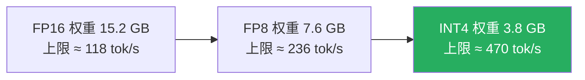
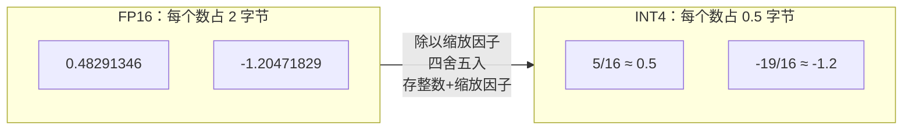
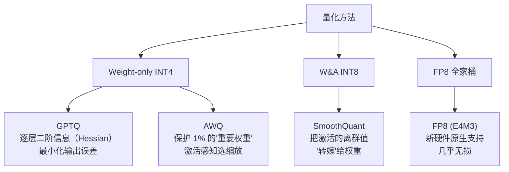

# Week 6 · 量化篇：第一个优化旋钮——把权重"压缩打包"

> 🎯 **本周目标**：搞懂量化的取舍，并亲手把 FP8 / INT4 变体用 Week 5 的压测框架和 FP16 基线对比。
> 这是路线图的**第一个优化技术**——前 5 周建的测量框架从本周开始兑现价值。
> 🔌 **GPU 日**：周四（部署量化变体）、周五（质量对照）。

---

## 0. 用 Roofline 看懂量化（Week 1 的模型又来收租了）

回忆 Week 1：单用户 decode 上限 = **带宽 ÷ 权重字节** = 1792 ÷ 15.2 ≈ 118 tok/s。

量化的作用一句话：**把"权重字节"这个分母变小**。



- **decode 阶段**：直接受益，上限翻倍/翻四倍（带宽瓶颈下，搬的字节减半 = 速度翻倍）
- **prefill 阶段**：受益有限（算力瓶颈，除非硬件有低精度矩阵单元，如 FP8 Tensor Core）
- **显存容量**：权重省下的空间全部让给 KV Cache 池 → 并发能力翻倍（"显存即吞吐"！）
- **代价**：模型质量可能下降——本周的核心就是**量化这笔账**

---

## 1. 量化基础：十分钟搞懂比特游戏

### 1.1 什么是量化

把高精度数字"四舍五入"到低精度网格上：



核心概念：
- **缩放因子（scale）**：一组数共享的"换算尺"，存储：`整数 × scale ≈ 原值`
- **分组（group size）**：每 128 个权重共享一个 scale（粒度越细误差越小，额外存储越多）
- **PTQ（训练后量化）**：训好的模型直接压，工程主流 ✅ 本周用它
- **QAT（量化感知训练）**：训练时就模拟量化，质量更好但成本巨大

### 1.2 量什么：三种对象

| 量化对象 | 收益 | 难度 |
|---|---|---|
| **权重（Weight-only）** | 显存 ÷4，decode 提速 | 简单 ✅ 主流 |
| 权重+激活（W&A） | 还能用低精度矩阵单元提速 prefill | 难（激活有离群值！）|
| KV Cache | KV 池容量翻倍 → 并发翻倍 | 中等（FP8 KV 已成熟）|

> ⚠️ **为什么激活难量化**：Transformer 的激活值里有少量"离群值"（outlier），数值是其他值的几百倍。一刀切的量化网格要么压扁正常值、要么浪费精度。LLM.int8()、SmoothQuant、AWQ 三个方法本质上都是**围着离群值打架**——这就是周三阅读的全部主线。

---

## 2. 方法地图：GPTQ / AWQ / SmoothQuant / FP8



| 方法 | 精度 | 一句话原理 | 江湖地位 |
|---|---|---|---|
| **GPTQ** | INT4/3/2 | 逐层量化，用二阶导数信息挑"对输出影响最小"的舍入方式 | 老牌通用，模型库最多 |
| **AWQ** | INT4 | 发现 1% 的权重对质量至关重要（激活感知），重点保护它们 | 质量通常略优于 GPTQ |
| **SmoothQuant** | INT8 | 激活难量化、权重好量化 → 数学变换把激活的"崎岖"转移给权重 | W&A INT8 的奠基作 |
| **FP8 (E4M3)** | 8 位浮点 | 保持浮点结构，H100/5090 原生 Tensor Core 支持 | **2024 后的新默认** |

### 2.1 一个必须知道的坑：格式 ≠ 提速

**量化格式存在，不代表硬件有对应的高速 kernel**。比如 INT4 权重 × FP16 激活的矩阵乘，需要专门的混合精度 kernel（Marlin、Machete 等）；没有 kernel 支持的"量化"只是省显存不提速。这就是为什么：

- 工程上只用量产的几种格式（AWQ/GPTQ/FP8），vLLM 全都内置了 kernel
- 选量化方法时先问：**我的 GPU + 引擎支持它的 kernel 吗？**（5090 是 Blackwell，FP8 和 Marlin INT4 都支持）

---

## 3. 推理工程师的三笔账（本周精华）

### 账一：速度（decode 上限）

```
上限 = 带宽 ÷ 权重字节
FP16: 1792 ÷ 15.2 = 118 tok/s
FP8:  1792 ÷ 7.6  = 236 tok/s   (×2.0)
INT4: 1792 ÷ 3.8  = 470 tok/s   (×4.0)
```

> ⚠️ 实际打 5-8 折：反量化（dequantize）本身要算力，INT4 kernel 开销更大。**实测才是王**——周四实验见分晓。

### 账二：显存（并发能力）

```
5090 32GB 为例（gpu-memory-utilization 0.9）：
FP16: 权重 15.2G → KV 池 ~13.6G → ~25 万 token
FP8:  权重 7.6G  → KV 池 ~21.2G → ~39 万 token (+56%)
INT4: 权重 3.8G  → KV 池 ~25.0G → ~46 万 token (+84%)
```

**量化省的不是显存，是并发、是钱。**

### 账三：质量（唯一的代价）

- FP8：通常无损（<0.5% 评测差异）→ **可以无脑用**
- INT4 (AWQ/GPTQ)：掉 0-2% → **看业务容忍度**
- INT3 及以下：明显掉分 → 科研区，别上生产

**决策框架**（路线图的原话）：如果 INT4 在你的质量代理上掉超过 1-2%，就保持 FP16/FP8 默认，**把 INT4 当"显存救急包"而不是"默认配置"**。

---

## 4. 别忘了我：KV Cache 量化

Week 1 算过：KV Cache 在并发场景比权重还吃显存。FP8 KV Cache（vLLM `--kv-cache-dtype fp8`）：

- KV 池容量直接 ×2（每 token 从 56KB → 28KB）
- 长上下文 + 高并发场景的救命招
- 质量影响极小（attention 对 KV 精度不敏感）
- 和权重量化**可以叠加**：INT4 权重 + FP8 KV = 显存利用率拉满

---

## 5. 实验手册（下次开机用 🔌）

### 周四：部署量化变体并同框架压测

```bash
# 变体1：FP8 在线量化（无需下载新模型，vLLM 启动时压）
vllm serve /model/ModelScope/Qwen/Qwen2.5-7B-Instruct \
  --quantization fp8 --max-model-len 8192 --gpu-memory-utilization 0.90

# 变体2：AWQ INT4（ModelScope 下载官方量化版，约 5.6GB）
# 平台模型库若有 Qwen2.5-7B-Instruct-AWQ 直接用，没有则 modelscope download
vllm serve /model/ModelScope/Qwen/Qwen2.5-7B-Instruct-AWQ \
  --max-model-len 8192 --gpu-memory-utilization 0.90
```

**压测协议**（复用 Week 5 框架，变量只有精度）：
1. 单流 decode 速度（验证上限 ×2/×4）
2. GuideLLM 同形状 sweep（拐点位置对比）
3. 启动日志对比 KV Cache 池大小

### 周五：质量对照（本周真正的交付物）

```python
# 固定 20 条中文常识/推理题，三个精度各跑一遍，人工+规则打分
# 交付的是这张表，不是速度数字：
| 精度 | 单流速度 | 总吞吐@64 | 质量得分 | 结论 |
| FP16 | 104 tok/s | 5193 | 基准 | |
| FP8  | ?         | ?     | ?     | |
| INT4 | ?         | ?     | ?     | |
```

---

## 5.5 ✅ FP8 实机战报（2026-09-08 · RTX 5090 · vLLM 0.28）

**部署方式**：在线量化（zero 下载）——同一个 FP16 模型路径，启动加 `--quantization fp8`，vLLM 启动时即时压缩。

### 账一：速度（Week 5 同形状：256 输入/128 输出）

| 指标 | FP16 | FP8 | 提升 |
|---|---|---|---|
| 单流 decode | 104 tok/s | **163.9 tok/s** | **×1.58** |
| 64 并发总吞吐 | 5193 tok/s | **7646 tok/s** | **×1.47** |
| 权重显存 | 14.29 GiB | **8.2 GiB** | -43% |

> ⚠️ 理论上限是 ×2（1792÷7.6=236 tok/s），实测 ×1.58——**反量化的算力开销吃掉了部分收益**，这就是笔记§3说的"实际打 5-8 折"。

### 账二：显存（KV Cache 池）

| | FP16 | FP8 | 变化 |
|---|---|---|---|
| KV Cache 容量 | 253,056 token | **329,904 token** | **+30%** |
| 8K 上下文并发上限 | 30.9 | **40.3** | +30% |

> ⚠️ 笔记§3预估 +56%，实测 +30%——FP8 在线量化只压线性层权重，**embedding/norm 等保持 BF16**（8.2 GiB 而非 7.6 GB），手算模型要按实测修正。

### 账三：质量（6 题抽查，temperature=0）

巴黎人口、铁vs棉花、星期推理、量子纠缠、七言诗、17×23——**6/6 全部正确**。与 FP16 答案逐字对比仅 1/6 完全相同（七言诗一字不差！），但其余 5 题均为**语义等价的措辞差异**，无事实/推理错误。

> 📌 FP8 的真实面貌：**输出不会逐字相同，但质量几乎无损**。质量敏感业务应该用业务题集做正式验收，而不是假设逐字一致。

### 本次踩坑

- 实例被定时关机后 5090 一度缺货，重试 10 分钟才开到机——**租卡平台不是无限库存，实验计划要留缓冲**
- FP8 首次启动 TTFT 较高（首次请求触发 kernel 编译），压测前要先热机

---

## 6. 决策点（背下来）

| 场景 | 选择 |
|---|---|
| 追求省心 | FP8：几乎无损，速度显存双赢，2024 后新默认 |
| 显存紧张（长上下文/高并发） | INT4 权重 + FP8 KV，双管齐下 |
| 质量敏感业务（医疗/法律/金融） | FP16/FP8 保底，INT4 需业务侧验收 |
| 老显卡（无 FP8 单元，如 V100） | AWQ INT4 是唯一现实选择 |

---

## 7. 自测题

1. 为什么量化对 decode 提速明显、对 prefill 提速有限？
2. 激活为什么比权重难量化？三个方法各怎么应对？
3. "INT4 量化"一定比 FP16 快 4 倍吗？（两个 caveat）
4. 5090 上把权重从 FP16 换 FP8，KV Cache 池大约变大多少？
5. 什么情况下 INT4 应该只是"救急包"而不是默认配置？

<details><summary>📖 参考答案</summary>

1. decode 是带宽瓶颈（搬运量=权重字节，直接减半）；prefill 是算力瓶颈，除非有低精度矩阵 kernel 否则算力没变快。
2. 激活有离群值。LLM.int8() 把离群维度单独用 FP16 算；SmoothQuant 把激活的崎岖转嫁给权重；AWQ 用激活分布挑出 1% 重要权重重点保护。
3. 不。反量化有算力开销；且需要硬件有对应 kernel 才有真提速。
4. 权重省 7.6GB 全给 KV 池：~13.6G→21.2G，大约 +56%（25→39 万 token）。
5. 当质量代理掉分超过业务容忍（通常 1-2%）时——INT4 降级为显存不足时的应急手段。

</details>

## 8. 名词小词典（本周新增）

| 英文 | 中文 |
|---|---|
| Quantization | 量化：高精度数字压缩到低精度 |
| PTQ / QAT | 训练后量化 / 量化感知训练 |
| Weight-only | 仅量化权重（激活保持 FP16） |
| Scale / Group size | 缩放因子 / 分组大小 |
| Activation Outlier | 激活离群值：量化质量的头号敌人 |
| Dequantize | 反量化：计算时把低精度数还原 |
| FP8 (E4M3/E5M2) | 8 位浮点格式（4位指数3位尾数 / 5位指数2位尾数） |
| Perplexity | 困惑度：最常用的质量代理指标 |

## 9. 原始学习资料

- 🎬 [MIT 6.5940 Lecture 5: Quantization I](https://www.youtube.com/watch?v=TSc_BibWRhM)（Song Han，[课程页](https://hanlab.mit.edu/courses/2024-fall-65940)）
- 📄 [Lilian Weng 推理优化综述 · 量化节](https://lilianweng.github.io/posts/2023-01-10-inference-optimization/)
- 📄 [vLLM 量化文档](https://docs.vllm.ai/en/latest/features/quantization/)
- 🎬 [QLoRA 作者 Tim Dettmers 讲座](https://www.youtube.com/watch?v=fQirE9N5q_Y)（buffer）
- 📄 论文（想深挖时）：GPTQ (2210.17323)、AWQ (2306.00978)、SmoothQuant (2211.10438)、LLM.int8() (2208.07339)
