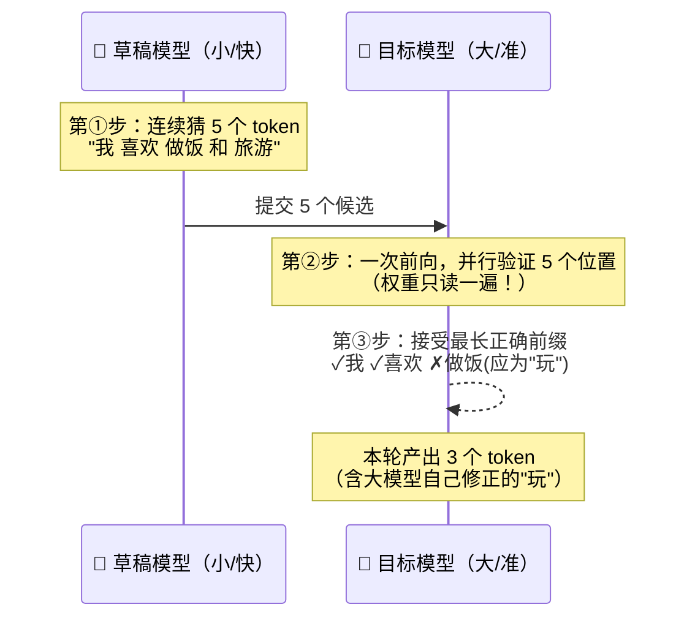
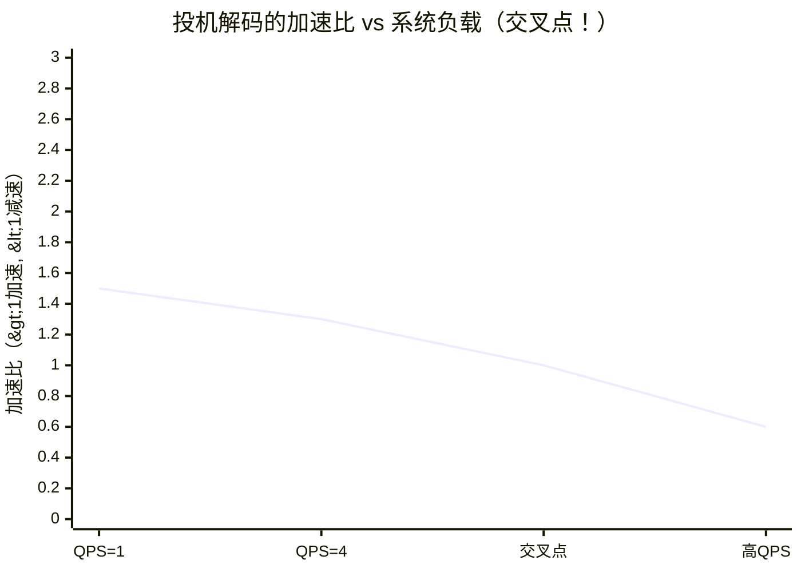
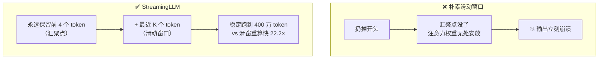

# Week 7 · 投机解码 + KV 驱逐：两个"反常识"加速术

> 🎯 **本周目标**：搞懂两个实现细节远比概念有趣的技术：
> ① **投机解码**——用闲置算力换串行等待，但它的收益曲线有一个"交叉点"
> ② **KV 驱逐**——长上下文的显存救星，核心发现叫"注意力汇聚"
> 🔌 **GPU 日**：周三（投机解码找交叉点）、周五（长上下文驱逐实测）。

---

## 1. 投机解码：让小模型当"枪手"，大模型当"阅卷老师"

### 1.1 回到 Week 1 的物理定律

单流 decode 的上限是 118 tok/s（5090 + 7B FP16），因为**每生成 1 个 token 都要把 15GB 权重读一遍**。带宽瓶颈的死结在于：串行，一次只能算一个。

但注意一个被浪费的事实：**带宽瓶颈时，算力大量闲置**（5090 上利用率 <5%）。投机解码的核心思想：

> **与其一次读权重算 1 个 token，不如一次读权重"验收" k 个 token——反正算力闲着。**

### 1.2 工作流程：三步循环



**关键性质**：
- **输出分布完全不变**：被接受的 token 必须和大模型自己生成的一模一样——数学上无损
- **加速来自并行验收**：一次权重读取产出 3-5 个 token 而非 1 个
- **收益取决于接受率**：草稿猜得越准，每轮接受的越多

### 1.3 四种"草稿"方案（vLLM 全都支持）

| 方案 | 草稿来源 | 优点 | 缺点 |
|---|---|---|---|
| **Draft Model** | 独立小模型（0.5B 草稿配 7B 目标） | 接受率高 | 要找同词表的小模型，多占显存 |
| **N-gram / Prompt Lookup** | 从 prompt 里查找重复片段 | 零成本零显存 | 只适合重复性文本（摘要/代码/翻译）|
| **EAGLE / Medusa** | 大模型自己长出的"小头" | 接受率最高 | 需要额外训练这个小头 |
| **MLPSpeculator** | 小型 MLP 外接层 | 轻量 | 接受率中等 |

> 💡 有趣的工程细节：N-gram 方案在摘要任务上能到 **2.8×** 加速——因为摘要大量复述原文，"从输入里抄"居然是最准的草稿。选方案要看负载特征，没有银弹。

### 1.4 本周灵魂：交叉点（Crossover）

vLLM 官方实测数据（Llama3-70B, 4×H100）：



- **低 QPS（系统空）**：带宽瓶颈 → 算力闲置 → 投机解码白捡 **1.5-2.8×** 加速
- **高 QPS（系统忙）**：连续批处理已把 GPU 推到算力瓶颈 → 草稿+验证的额外计算是**纯负担** → **1.4-1.8× 减速**！

> 🔑 **为什么必然有交叉点**：Week 1 的 roofline 说了算。低负载在斜线区（算力免费），高负载在平台区（算力宝贵）。投机解码是"用算力换带宽"的技术，算力从免费变宝贵的那一刻，它就由赚变赔。
>
> 📌 **工程结论**：找到你自己的交叉点（周三实验），比记住"投机解码能加速"重要十倍。生产上要么按负载动态开关（vLLM 在做的 dynamic speculative decoding），要么只在低峰期开启。

---

## 2. KV 驱逐：长上下文的显存救星

### 2.1 问题：KV Cache 随长度无限增长

Week 1 算过：Qwen2.5-7B 每 token KV = 56KB。100 万 token 的上下文 = **56GB**，一张卡装不下。而且 attention 的计算量还随长度平方增长。

自然的想法：**只留最近的 K 个 token 的 KV（滑动窗口），老的扔掉**。可惜实测一扔就崩——为什么？

### 2.2 核心发现：注意力汇聚（Attention Sink）

StreamingLLM（ICLR 2024）发现了一个反直觉现象：

> **模型的注意力会不约而同地把大量分数分配给开头的几个 token**——哪怕它们语义上毫无意义（比如句首的 `<s>`）。这些 token 被称为"注意力汇聚点"（sink），它们扮演着"注意力垃圾桶"的角色：当前 token 没什么可关注的时候，就把多余的注意力权重倒在这里。



**保留方案**：`前 4 个 token + 最近 K 个 token`，其他丢弃。就这么简单，效果惊人——不需要微调，模型直接获得"无限"上下文能力。

### 2.3 驱逐策略全家谱

| 策略 | 保留什么 | 适用 |
|---|---|---|
| 滑动窗口 | 最近 K 个 | 短依赖任务（会崩开头，慎用） |
| **StreamingLLM** | 前 4 个 sink + 最近 K 个 | 流式长对话 ✅ |
| H2O | 按历史注意力分数留"重要"的 | 长文档问答 |
| SnapKV | 按 prompt 末尾的注意力留 | RAG/长 prompt |
| 前缀缓存 | 全部保留但共享 | 多用户共享前缀（Week 4）|

### 2.4 工程现实

- vLLM 对滑动窗口类模型（如 Mistral）原生支持；通用驱逐策略多在研究/插件层
- **更主流的生产答案其实是组合技**：GQA（Week 1）+ FP8 KV（Week 6）+ 前缀缓存（Week 4）+ 驱逐（本周）
- 周五实验：用长上下文负载实测 KV 池水位变化，理解"为什么长上下文是并发的天敌"

---

## 3. 实验手册（下次开机用 🔌）

### 周三：投机解码找交叉点

```bash
# 方案选 N-gram（零下载零显存，最适合我们的单卡 7B 场景）
vllm serve /model/ModelScope/Qwen/Qwen2.5-7B-Instruct \
  --speculative-config '{"method": "ngram", "num_speculative_tokens": 5, "prompt_lookup_max": 5}' \
  --max-model-len 8192 --gpu-memory-utilization 0.90

# 测试协议（复用 Week 5 框架）：
# ① 单流 decode 速度 vs FP16 基线 104 tok/s（预期：低负载加速）
# ② 64 并发总吞吐 vs FP16 基线 5193 tok/s（预期：高负载减速！）
# → 两个数字之间的负载区间就是交叉点
```

### 周五：长上下文 + 驱逐观察

```python
# 构造 4K/8K 长上下文请求，观察：
# ① KV 池水位（Grafana: kv_cache_usage_perc）
# ② 并发数对 TTFT/ITL 的影响（长上下文 = 每步 KV 读取量大，decode 更慢）
# ③ （可选）--kv-cache-dtype fp8 对比：长上下文场景的救星组合
```

---

## 3.5 ✅ 投机解码实机战报（2026-09-08 · RTX 5090 · vLLM 0.28 · N-gram 方案）

**配置**：`--speculative-config '{"method": "ngram", "num_speculative_tokens": 5, "prompt_lookup_max": 5}'`

### 结果：全线减速（负结果，但极其有价值）

| 场景 | FP16 基线 | N-gram 投机 | 变化 |
|---|---|---|---|
| 单流 decode（重复文本） | 104 tok/s | 88 tok/s | **-15%** ❌ |
| 单流 decode（自然文本·写诗） | 104 tok/s | 82-90 tok/s | **-15%** ❌ |
| 64 并发总吞吐 | 5193 tok/s | 1558 tok/s | **-70%** ❌❌ |

**最反直觉的数据**：接受率高达 **98.6%**（草稿几乎全中），却依然减速！

### 为什么 100% 接受率还会慢？（本周最佳案例）

```
每步耗时 = GPU 验证(5+1 token) + CPU n-gram 查找
                ↓                      ↓
        几乎免费(算力闲置)      纯 Python，随上下文变长
                                且 ngram 模式下 async scheduling 被禁用
                                → CPU 与 GPU 串行，无法重叠！
```

瓶颈从**带宽**（Week 1 第二 regime）转移到了**开销**（第一 regime）——每步 GPU 只要 ~10ms，CPU 查找却要 50-60ms。**三个 regime 理论在真实系统上完成闭环**。

### 负结果的工程价值

1. **交叉点在我们的系统上低于 QPS=1**——N-gram 方案在此栈上永远不赚，这就是"找到自己的交叉点"的含义
2. 官方 2.8× 是旧版本 + H100 + 特定负载——**硬件/版本/负载一变，结论就要重测**
3. 生产正确姿势：草稿用 GPU 侧方案（EAGLE/draft model）+ 动态开关，避开 CPU 起草的坑
4. 发布 benchmark 要敢发负结果——**这比假加速有用一百倍**

---

## 4. 决策点

| 场景 | 投机解码 | KV 驱逐 |
|---|---|---|
| 低 QPS / 单用户产品（IDE 插件、个人助手） | ✅ 开，白捡 1.5-2.8× | 看上下文长度 |
| 高 QPS 共享服务 | ❌ 关，会减速 | 必配 |
| 摘要/翻译/代码补全 | ✅ N-gram 效果拔群 | - |
| 无限流式对话 | - | StreamingLLM 思路 |
| 长文档 RAG | - | H2O/SnapKV + FP8 KV |

---

## 5. 自测题

1. 投机解码为什么不改变模型的输出分布？
2. 用 roofline 解释：为什么高 QPS 下投机解码反而减速？
3. 为什么 N-gram 在摘要任务上效果特别好？
4. 朴素滑动窗口为什么会让模型立刻崩溃？StreamingLLM 怎么修？
5. 生产系统想用投机解码，最稳妥的策略是什么？

<details><summary>📖 参考答案</summary>

1. 接受的 token 必须与大模型 greedy/采样分布一致，草稿只影响速度不影响结果——验证步骤保证了数学等价。
2. 投机解码是"用算力换带宽"。低 QPS 时系统在 roofline 斜线区（带宽瓶颈，算力免费）；高 QPS 时被连续批处理推到平台区（算力瓶颈），草稿+验证的额外算力成为纯开销。
3. 摘要大量复述原文片段，"从 prompt 里查重复"命中率极高且零成本。
4. 模型把大量注意力权重默认分配给开头几个 token（sink）；扔掉它们后注意力权重无处安放，softmax 分布崩溃。保留前 4 个 sink token + 滑窗即可修复。
5. 按负载动态开关（或动态调整投机长度）——低峰开高峰关，把交叉点运营化。

</details>

## 6. 名词小词典（本周新增）

| 英文 | 中文 |
|---|---|
| Speculative Decoding | 投机解码：小模型猜、大模型验 |
| Draft Model / Target Model | 草稿模型 / 目标模型 |
| Acceptance Rate | 接受率：草稿被采纳的比例，收益的决定因素 |
| N-gram / Prompt Lookup | N-gram 投机：从 prompt 查重复片段当草稿 |
| EAGLE / Medusa | 大模型自长"草稿头"的投机方案 |
| Attention Sink | 注意力汇聚：开头 token 充当"注意力垃圾桶"的现象 |
| KV Eviction | KV 驱逐：丢弃部分历史 KV 省显存 |
| Sliding Window | 滑动窗口：只留最近 K 个 token |
| Crossover Point | 交叉点：投机解码由赚变赔的负载临界 |

## 7. 原始学习资料

- 📄 [vLLM 投机解码 benchmark 博客](https://blog.vllm.ai/2024/10/17/spec-decode.html)（交叉点数据的出处）
- 🎬 [GPU MODE Lecture 22: vLLM 投机解码实现](https://www.youtube.com/watch?v=9wNAgpX6z_4)（作者亲自讲）
- 📄 [vLLM 投机解码文档（方法选择表）](https://docs.vllm.ai/en/latest/features/speculative_decoding/)
- 📄 [StreamingLLM 论文 (ICLR 2024)](https://arxiv.org/abs/2309.17453)
- 📄 [EAGLE 论文](https://arxiv.org/abs/2401.15077)（buffer）
