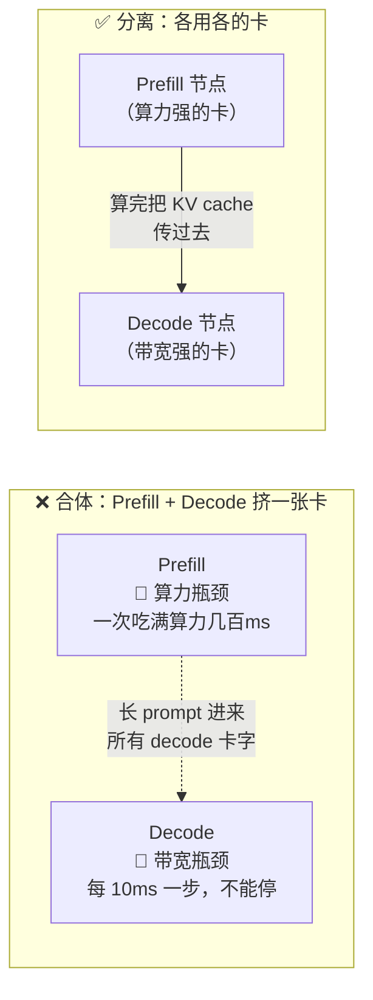
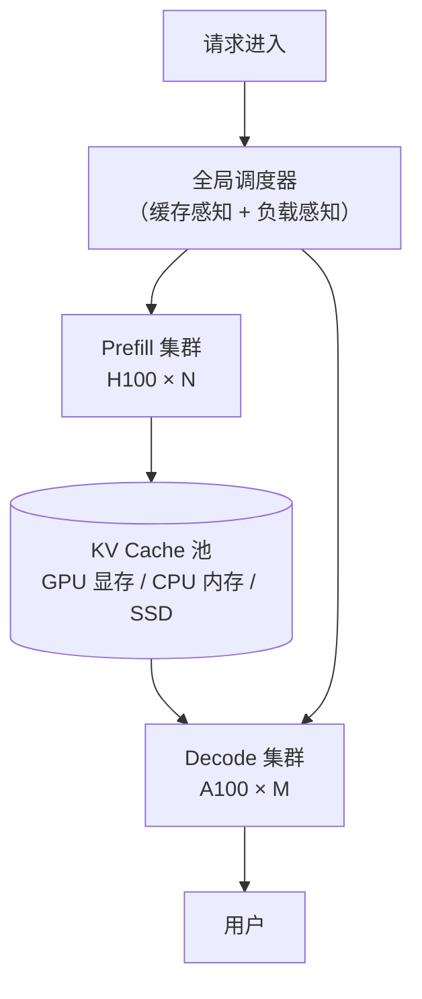
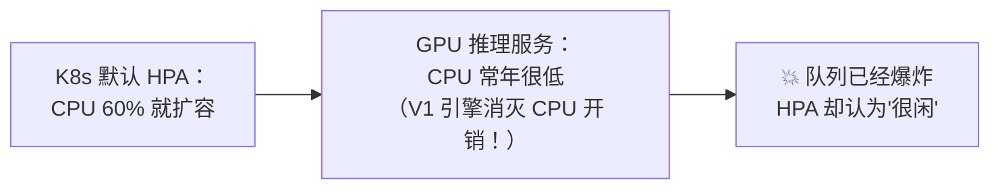
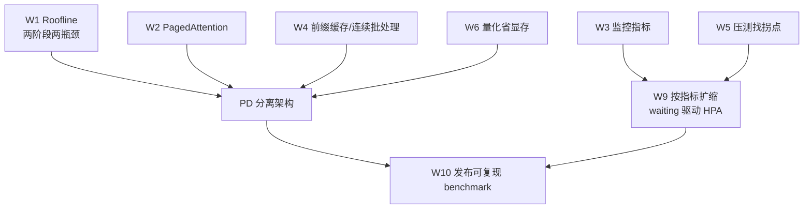

# Week 8 · 分离式服务 + Kubernetes：当"两阶段两瓶颈"变成架构

> 🎯 **本周目标**：理解推理系统的"终局架构"——PD 分离（Prefill/Decode Disaggregation），以及承载它的 Kubernetes 弹性层。
> Week 1 的那句"prefill 是算力瓶颈、decode 是带宽瓶颈"，本周要长成一套真实的分布式系统。
> 🔌 **GPU 日**：周四/周五（可用单机模拟，或 kind 本地集群）。

---

## 0. 为什么需要"拆开"？一图看懂矛盾



Week 3 学的 chunked prefill 是"一张卡内的妥协方案"（把 prefill 切片塞进 decode 空隙）。Week 8 的问题是更激进的：**既然两种负载的性格完全相反，为什么不干脆分开部署？**

| | Prefill | Decode |
|---|---|---|
| 瓶颈 | 算力 | 带宽 |
| 延迟敏感度 | 一次几百 ms 完成即可 | **每步**都要快（ITL 10ms 级） |
| 理想硬件 | 算力怪兽（H100） | 带宽怪兽/省电卡（A100 甚至 L40S） |
| 被打扰时 | 慢一点没关系 | 用户立刻看到"卡字" |

---

## 1. 三篇论文，一条演进线

### 1.1 DistServe（OSDI 2024）：证明"拆开值得"

- 把 prefill 和 decode 部署到不同 GPU，各自独立扩缩容
- 成绩：**同等 SLO 下多服务 7.4× 请求**，或**把 SLO 收紧 12.6×**
- 核心洞察：合体的最大成本不是资源争抢本身，而是**两个阶段互相打断**——长 prompt 进来时所有 decode 的 ITL 集体恶化（我们 Week 3 笔记里 chunked prefill 缓解但没根除的问题）
- 关键工程问题：**KV cache 怎么从 prefill 节点搬到 decode 节点？**（答案：高速互联直接 DMA，NVLink/RDMA，比你想的快）

### 1.2 Splitwise（Microsoft, ISCA 2024）：拆开还能"混搭配置"

- 更进一步：**prefill 用 H100（算力），decode 用限电的 A100（便宜省电）**
- 成绩：**1.4× 吞吐，同时成本降 20%**
- 这是 Week 9 单位经济学的预告：PD 分离不仅是性能技术，更是**成本技术**——给不同性格的负载配不同价格的硬件

### 1.3 Mooncake（月之暗面, FAST 2025 最佳论文）：KV cache 成为一等公民

- Kimi 的生产系统：不再只是"两台机器分工"，而是**一个以 KV cache 为中心的分布式缓存池**
- prefill 节点、decode 节点、CPU 内存、甚至 SSD 组成 KV cache 的**分级存储**
- 调度器以"最大化前缀缓存命中 + 负载均衡"为目标分配请求
- 代表了分离式服务的终极形态：**P/D 分离 + 前缀缓存 + 分级存储**三合一



---

## 2. 引擎层的现状（2025）

| 项目 | PD 分离支持 |
|---|---|
| vLLM | `disagg_prefill` 示例 + NIXL 传输层；production-stack Helm 一键部署 |
| SGLang | PD disaggregation 文档完善，Mooncake 作者团队深度合作 |
| NVIDIA Dynamo | 把 PD 分离 + KV 路由做成完整分布式框架 |
| llm-d | 红帽主导的 K8s 原生分离式 serving |

> 💡 **学习优先级**：理解三篇论文的思想 >> 跑通某一个具体框架。框架每季度都在变，思想五年不变。

---

## 3. Kubernetes 层：推理服务的"操作系统"

### 3.1 为什么需要 K8s

单卡实验到此为止，生产要面对：多台机器、流量波动、故障重启、滚动升级。K8s 是标准答案——但有一个**致命的经典错误**：

### 3.2 本周灵魂：为什么不能用 CPU 利用率做自动扩缩



回忆 Week 2：vLLM V1 的整个设计目标就是**压低 CPU 占用**。所以：

- ❌ CPU 利用率：和 GPU 忙不忙几乎无关
- ✅ **`num_requests_waiting`（排队深度）**：直接反映"用户是不是在等"——这才是扩容信号
- 工具：KEDA（自定义指标扩缩容器）+ Prometheus 适配器，把 vLLM 指标接给 HPA

### 3.3 扩容的特殊性（和普通 Web 服务的区别）

| | 普通 Web 服务 | GPU 推理服务 |
|---|---|---|
| 扩容信号 | CPU/QPS | **队列深度**（waiting 数） |
| 启动时间 | 秒级 | **分钟级**（加载 15GB 权重 + 编译 kernel） |
| 扩容策略 | 弹性快速 | 需要**预留缓冲**（预热池）或接受冷启动 |
| 缩容风险 | 低 | 高（杀掉 pod = 丢掉上面的 KV cache 和前缀缓存）|

> 🔑 一句话：**GPU 服务的弹性是"以队列深度为信号、以预热池为缓冲"的艺术。**

---

## 4. 实验手册（下次开机用 🔌，单机可行）

我们单机 5090 无法真正做双节点 PD 分离，但可以完成**思想等效实验**：

```bash
# 实验A（必做）：vLLM production-stack 的 Helm chart 阅读 + kind 本地集群部署
# 目标：看懂一个生产级推理服务的 K8s 清单长什么样
git clone https://github.com/vllm-project/production-stack
# 重点读：values.yaml 里的 resources、HPA 配置、监控注解

# 实验B（必做）：KEDA 按队列深度扩缩（单机 1-2 副本也能演示）
# 观察：用 Week 5 的压测工具打满服务 → waiting 上升 → 触发扩容事件
# 对比：把指标换成 CPU，观察 HPA 毫无反应（证明 CPU 指标失效）

# 实验C（选做，需租双卡）：真正的 PD 分离
# vllm 官方 disagg 示例：一个 prefill 实例 + 一个 decode 实例 + NIXL 传输
```

---

## 5. 全景图：八周知识在此会师



**本周认知升级**：从"把单卡调好"升级为"设计一个会呼吸的系统"——流量来了扩容、流量走了缩容、不同负载住在不同硬件上。

---

## 6. 决策点

| 场景 | 选择 |
|---|---|
| 单卡够用（<100 并发） | **不要上 K8s**——单机 Docker + 监控已足够，复杂度是税 |
| 多卡单机房 | vLLM production-stack / SGLang PD，先合体再按需分离 |
| 大规模生产（Kimi 级） | Mooncake 式 KV 中心架构 |
| K8s 吃掉了整个学习 session | 退回单机 Docker + 只读 KEDA 文档（路线图原话：扩缩信号比集群重要）|

## 7. 自测题

1. chunked prefill 和 PD 分离解决的是同一个问题的两个层面，分别是什么？
2. 为什么 decode 节点被打扰的代价比 prefill 节点高？
3. Splitwise 为什么能既提速又降本？
4. 为什么 CPU 利用率对 GPU 推理服务是个坏扩缩信号？正确信号是什么？
5. GPU 服务扩容为什么要"预热池"？

<details><summary>📖 参考答案</summary>

1. chunked prefill 是单卡内的时间片复用（把 prefill 切碎塞空隙）；PD 分离是空间上的资源隔离（两个阶段各用各的硬件）。
2. decode 是每 10ms 一步的连续流，任何停顿用户立刻感知"卡字"；prefill 是一次性任务，慢一点只影响 TTFT。
3. prefill 是算力瓶颈配 H100 物尽其用；decode 是带宽瓶颈用便宜的限电 A100 已够——按负载性格配硬件，总成本下降。
4. V1 引擎刻意压低了 CPU 开销，CPU 闲 ≠ GPU 闲。正确信号是 num_requests_waiting（排队深度）。
5. 新实例要加载权重+编译 kernel（分钟级），等扩容完成流量高峰已过；预热池保持少量热实例随时候命。

</details>

## 8. 名词小词典（本周新增）

| 英文 | 中文 |
|---|---|
| PD Disaggregation | PD 分离：prefill/decode 分节点部署 |
| KV Transfer / NIXL | KV cache 跨节点传输（及其实现库） |
| HPA (Horizontal Pod Autoscaler) | K8s 水平扩缩容器 |
| KEDA | 基于自定义指标（如队列深度）的 K8s 扩缩器 |
| Warm Pool | 预热池：保持热实例应对冷启动 |
| KV-centric Scheduling | 以 KV cache 为中心的调度（Mooncake） |

## 9. 原始学习资料

- 🎬 [DistServe @ OSDI 2024 演讲](https://www.youtube.com/watch?v=WwJvecXOeUA) · [论文](https://www.usenix.org/conference/osdi24/presentation/zhong-yinmin)
- 📄 [Splitwise (ISCA 2024)](https://arxiv.org/abs/2311.18677)
- 📄 [Mooncake (FAST 2025 最佳论文)](https://arxiv.org/abs/2407.00079)
- 📄 [vLLM disaggregated prefill 文档](https://docs.vllm.ai/en/latest/features/disagg_prefill/) · [production-stack](https://github.com/vllm-project/production-stack)
- 📄 [SGLang PD disaggregation](https://docs.sglang.io/docs/advanced_features/pd_disaggregation)
- 📄 [KServe + KEDA 按队列扩缩实战](https://developers.redhat.com/articles/2025/09/23/how-set-kserve-autoscaling-vllm-keda)
- 📄 生态地图：[NVIDIA Dynamo](https://github.com/ai-dynamo/dynamo) · [llm-d](https://llm-d.ai)
