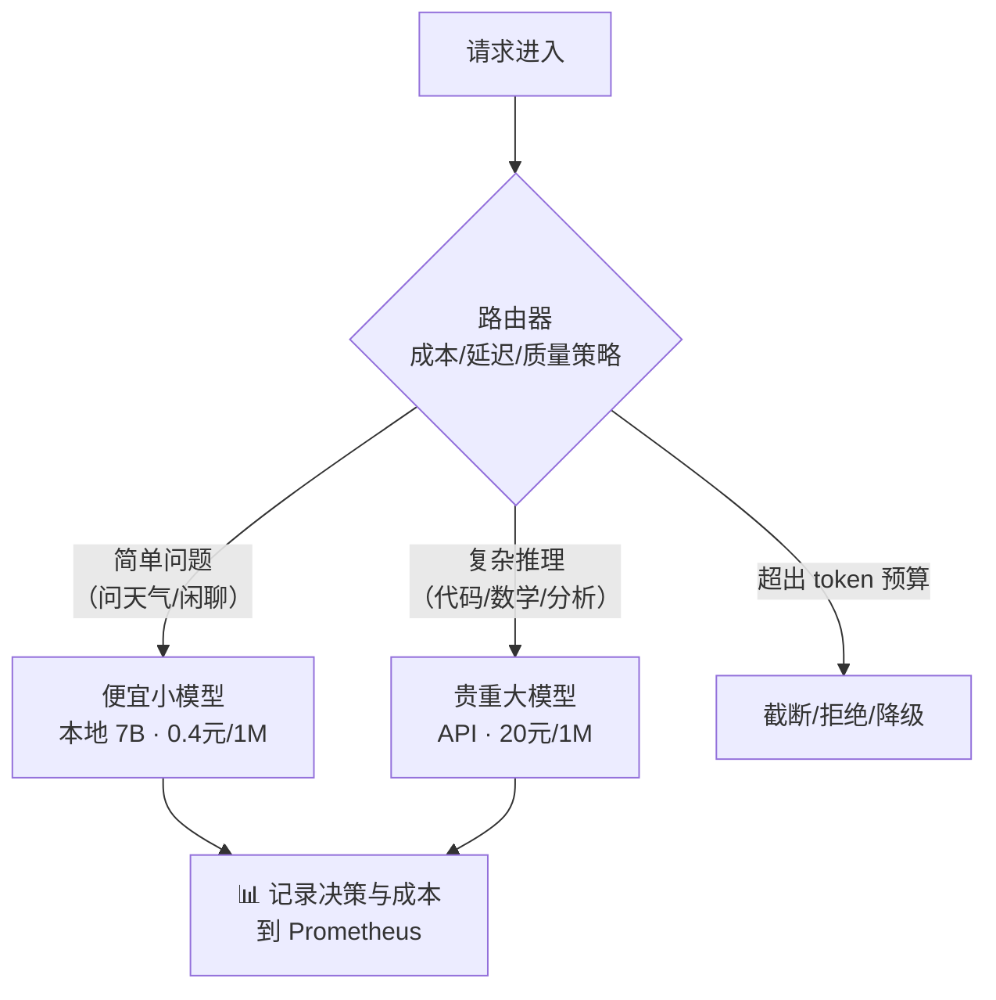

# Week 9 · 单位经济学 + 成本路由器：从"跑得快"到"算得清"

> 🎯 **本周目标**：把前 8 周的技术能力翻译成钱——算出你自己 GPU 的 $/1M tokens，并写一个按"成本/延迟/质量"选路的路由器。
> 本周开始，我们不再只关心延迟，开始关心**利润率**。
> 💻 **大部分工作不需要 GPU**（用 Week 5 的真实数据算账 + 本地写代码）。

---

## 0. 一个公式统治本周

推理成本的本质：**GPU 按小时收费，token 按个产出**。

```
每百万 token 成本 = 小时租金 ÷ (峰值吞吐 × 3600秒 × 利用率) × 1,000,000
```

三个因子，就是推理经济学的一切：
1. **小时租金**：硬件价格（你说了不算，市场说了算）
2. **峰值吞吐**：Week 1-8 学的全部技术都在推这个数（你能控制的）
3. **利用率**：峰值吞吐有多少时间被真正用满（**运营说了算，也是最容易被忽视的**）

> 🔑 TensorEconomics 的核心结论：**决定成本的是利用率，而不是显卡单价。** 一张 ¥30/h 的卡跑满，比一张 ¥3/h 的卡闲 90% 便宜得多。

---

## 1. 用我们自己的真实数据算账（Week 5 的回报）

我们的实机数据：RTX 5090，¥3.21/h，Week 5 实测拐点吞吐。

### 算一遍（跟着按计算器）

```
已知：租金 3.21 元/h
Week 5 拐点实测：20 RPS × 128 输出token ≈ 2500 输出 tok/s

理想满产（利用率 100%）：
  每小时产出 = 2500 × 3600 = 9,000,000 输出 token
  成本 = 3.21 ÷ 9 = 0.36 元/百万输出 token  ≈ $0.05/1M

现实利用率 30%（流量有峰谷，已算不错）：
  成本 = 0.36 ÷ 0.3 = 1.19 元/百万 token

利用率 10%（服务闲置严重）：
  成本 = 0.36 ÷ 0.1 = 3.57 元/百万 token ← 贵了 10 倍！
```

### 三种业务形态的对照

| 形态 | 利用率 | 我们的成本 | 该自建吗？ |
|---|---|---|---|
| 个人玩具（每天聊几十次） | <1% | ~40 元/1M | ❌ 调 API 便宜 100 倍 |
| 公司内部服务（工作时间集中） | 20-40% | ~1-2 元/1M | ⚖️ 临界点，看合规需求 |
| 高并发产品（7×24 稳定流量） | 60-80% | ~0.5-0.6 元/1M | ✅ 自建省钱 |

> 💡 **这就是"大模型经济学"的全部秘密**：同一个模型同一张卡，成本可以差 100 倍，差异全在利用率。**所有降本技术（连续批处理、量化、投机解码）的本质都是提升"每美元产出 token 数"。**

---

## 2. 案例：Character.AI 怎么把成本砍 33 倍

Character.AI（角色扮演聊天，DAU 千万级）公开过自己的降本路径，**每一个杠杆都是我们已经学过的**：

| 杠杆 | 我们的对应章节 | 收益 |
|---|---|---|
| INT8 量化（权重+激活+KV cache） | Week 6 | 显存和带宽减半 |
| Multi-Query Attention（MQA） | Week 1 GQA 的极端版 | KV cache 缩小 8× |
| 跨层共享 KV（相邻层共用一份 KV） | Week 1 KV 原理的进阶 | KV 再缩 2-3× |
| 本地 attention + 全局 attention 混合 | Week 7 驱逐思想 | 长序列成本大降 |
| 自研 kernel + 状态机式对话管理 | Week 2 引擎层 | 吞吐数倍提升 |

**33× = 一堆 1.5×~3× 的杠杆相乘**。这就是为什么顶级推理工程师值百万年薪——每多一个杠杆，公司利润率就上一个台阶。

---

## 3. 成本路由器：把经济学写成代码

### 3.1 为什么需要路由器

真实业务里请求并不平等：



**核心思想**：90% 的请求用 10% 的成本处理掉，把昂贵模型留给真正需要它的 10%。

### 3.2 路由器设计三要素

1. **分类策略**：怎么判断"简单还是复杂"？
   - 简单版：关键词/长度启发式
   - 进阶版：用 7B 模型自己先做一道"难度分类"（成本忽略不计）
2. **降级链**：`大模型 → 小模型 → 缓存回答`，每一跳成本降一个量级
3. **可观测**：每个决策记录（选了谁、花了多少、为什么）——Week 3 的 Prometheus 直接复用

### 3.3 Token 预算中间件

成本失控的头号来源：**个别用户发出巨型 prompt 或要求超长输出**。中间件逻辑：

```python
# 伪代码
if prompt_tokens > budget.input_limit:
    return reject_or_truncate("超出输入预算")
estimated_cost = (prompt_tokens * in_price + max_tokens * out_price) / 1e6
if estimated_cost > budget.per_request_limit:
    return downgrade_to_cheaper_model()
```

---

## 4. 实验手册（本地可做，GPU 可选 🔌）

```bash
# 实验A（纯计算，必做）：算你自己的 $/1M
# 用 Week 5 的 guidellm_sweep.json 真实数据 + 你的实际租金
# 画出"利用率 vs 成本"曲线，找到自己的盈亏平衡点

# 实验B（写代码，必做）：FastAPI 写一个 30 行的路由器
# - /v1/chat/completions 接收 OpenAI 格式
# - 启发式分类 → 转发到 vLLM(:8000) 或 SGLang(:8001)
# - 每请求记录 tokens 和估算成本到 Prometheus

# 实验C（可选 GPU）：给路由器接上真实的两个后端，验证决策日志
```

---

## 5. 决策点

| 场景 | 选择 |
|---|---|
| 利用率 < 20% | 别自建，调 API；或者合并多个业务共用一张卡 |
| 延迟敏感 + 成本敏感 | 路由器 + 分级模型，简单请求本地跑 |
| 流量峰谷明显 | 按队列深度扩缩（Week 8）+ 预热池，把谷时成本砍掉 |
| 成本优化不知从何下手 | **先算利用率**——它通常比任何技术优化都值钱 |

## 6. 自测题

1. 写出 $/1M tokens 公式，并指出三个因子分别由什么决定。
2. 为什么说"利用率比显卡单价更重要"？
3. Character.AI 的 33× 里，有哪些杠杆是我们课程里学过的？（至少三个）
4. 路由器按什么把请求分级？为什么不全用大模型？
5. Token 预算中间件防的是什么风险？

<details><summary>📖 参考答案</summary>

1. 租金÷(峰值吞吐×3600×利用率)×1M；租金由市场、峰值吞吐由技术栈、利用率由运营/流量形态决定。
2. 成本与利用率成反比，利用率从 10% 到 60% 就是 6 倍成本差——远超不同显卡间的价差。
3. INT8 量化（W6）、MQA（W1 KV 原理）、跨层共享 KV（W1）、混合 attention（W7 驱逐）、自研引擎（W2）。
4. 按问题难度/质量需求分级。90% 的请求是简单的，用小模型的成本就能满足，大模型留给 10%。
5. 个别巨型请求吃掉整张卡的产能（成本 + 拖慢所有用户）——预算中间件是公平性和成本的双重守门员。

</details>

## 7. 名词小词典（本周新增）

| 英文 | 中文 |
|---|---|
| Unit Economics | 单位经济学：单个 token/请求的成本结构 |
| Utilization | 利用率：峰值产能被真正使用的时间比例 |
| Cost per 1M tokens | 每百万 token 成本：行业统一计价单位 |
| Router | 路由器：按策略为请求选择后端的服务 |
| Token Budgeting | token 预算：限制单请求的输入/输出额度 |
| Graceful Degradation | 优雅降级：昂贵后端不可用时降到便宜方案 |

## 8. 原始学习资料

- 📄 [LLM Inference Economics from First Principles](https://www.tensoreconomics.com/p/llm-inference-economics-from-first)（本周主教材）
- 📄 [DigitalOcean: LLM 推理成本计算实例](https://www.digitalocean.com/community/tutorials/llm-inference-cost)
- 📄 [Character.AI 推理优化](https://blog.character.ai/optimizing-ai-inference-at-character-ai-2/)（33× 降本案例）
- 📄 [NVIDIA: Mastering LLM Inference Optimization](https://developer.nvidia.com/blog/mastering-llm-techniques-inference-optimization/)（全课程复习）
